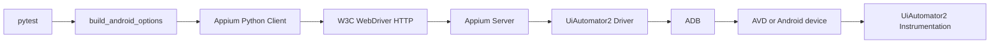
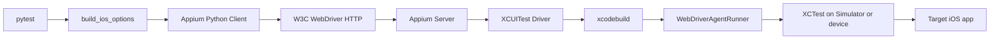

# Mobile Driver Call Chain

## Purpose

This document records the read-only Agent analysis performed for Day 4. It
compares Android and iOS from the pytest entry point through Appium to the
device-side automation runtime.

## Android Call Chain

Implementation evidence:

- `packages/qa_core/driver/android.py`
- `tests/android/test_session.py`
- Day 3 verified Appium 2.19.0 and UiAutomator2 Driver 4.2.9.

## iOS Call Chain

Implementation evidence:

- `packages/qa_core/driver/ios.py`
- `tests/ios/test_session.py`
- Appium 2.19.0 accepts XCUITest Driver 8.4.3.

The first session is slower than later sessions because Appium may build WDA,
install it, launch `WebDriverAgentRunner`, and wait for the Simulator or device
to become reachable.

## Boundary Comparison

| Boundary | Android | iOS |
| --- | --- | --- |
| Appium Driver | UiAutomator2 | XCUITest |
| Host bridge | ADB | Xcode and `xcodebuild` |
| Device runner | UiAutomator2 instrumentation | WebDriverAgentRunner under XCTest |
| Primary host dependency | Android SDK and ADB | macOS and Xcode |
| Common Windows failure | AVD not started or ADB disconnected | Cannot build WDA at all |
| Session setup artifact | UiAutomator2 server APKs | WDA application and XCTest runner |
| Common port | ADB transport | WDA local or remote port |

## Agent Review Findings

1. Both factories should keep the same public shape: typed settings in, WebDriver
   session out. This lets higher-level tests share lifecycle and diagnostics.
2. Android has a host prerequisite that can be repaired on Windows. iOS depends
   on macOS for WDA even when Appium and the client package are installed.
3. Platform-specific capabilities must stay inside the driver factories. A
   future `PlatformAdapter` should own lifecycle and diagnostics, not spread
   `if platform` checks through tests.
4. A successful Python import proves only that the client package is installed.
   It does not prove that the Driver, WDA build, Simulator, port, and target app
   can work together.
5. Session evidence must come from the real command result: Appium `POST
   /session`, WDA build output, Simulator state, and pytest. Static source
   inspection cannot replace a macOS execution result.

## Verification Boundary

On Windows, the project can verify typed iOS capabilities, package imports,
Appium Driver installation, and automatic test skip behavior.

The following remain macOS-only:

- Xcode command-line tools and an installed Simulator runtime
- WDA build and signing
- Simulator boot and UI access
- Real XCUITest session creation and teardown
