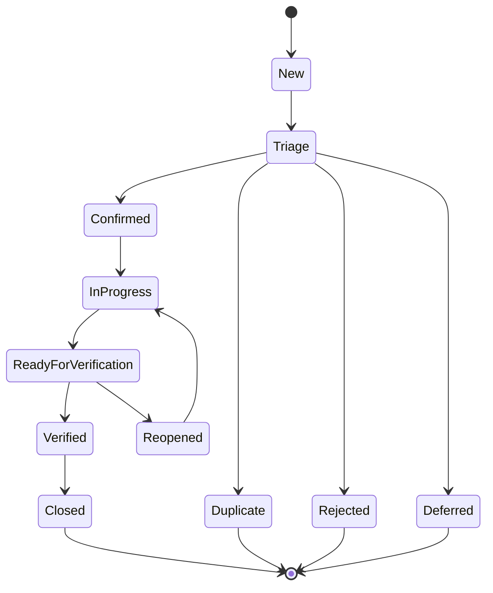

# Defect Lifecycle, Fingerprint, and Allure Linking

## System Boundaries

The project keeps execution, reporting, test management, and defect management
separate:

| System | Responsibility |
| --- | --- |
| GitHub Actions | Trigger, schedule, execute, and archive evidence |
| Allure | Test evidence, diagnostics, history, and links |
| Future test management | Cases, plans, runs, and traceability |
| Future issue tracker | Defect state, owner, priority, and verification |

Allure is not a defect tracker. GitHub Actions is not a defect tracker.

## Lifecycle



Required normal flow:

```text
New
-> Triage
-> Confirmed
-> In Progress
-> Ready for Verification
-> Verified
-> Closed
```

Allowed exception states are `Duplicate`, `Rejected`, `Deferred`, `Won't Fix`,
and `Reopened`.

## Required Defect Content

- Test ID, pytest node ID, fingerprint, and Allure result path.
- CI run URL, commit, environment, and first failing command.
- API/App version and relevant service version.
- Platform, device, OS, Appium, and Driver versions.
- First failure, expected result, actual result, and reproducible steps.
- Screenshot, page source, logs, HTTP response, or SQL evidence where relevant.
- Severity, priority, owner, and target date after human triage.
- Linked requirement, test case, fix PR, and regression run.

Never include secrets, private keys, certificates, production credentials, or
unfiltered production data.

## Fingerprint

The fingerprint input has eight normalized fields:

| Field | Purpose | Example |
| --- | --- | --- |
| `test_id` | Stable test identity | `SMOKE-ANDROID-SESSION-001` |
| `failure_type` | Coarse failure class | `assertion`, `timeout`, `connection` |
| `top_stack_frames` | Strongest code location, maximum five frames | test function and request call |
| `error_signature` | Stable exception or assertion summary | `assert 503 == 200` |
| `platform` | Failure boundary | `api`, `android`, `ios`, `cross-platform`, `infrastructure` |
| `device_class` | Device or runtime class, not a unique serial | `emulator-api-35`, `iphone-simulator` |
| `app_version_bucket` | Version bucket, not every build number | `mobile-1.8.x`, `sut-0.1` |
| `environment` | Execution environment | `local`, `ci`, `performance` |

`qa_core.reporting.DefectFingerprint` collapses repeated whitespace, limits the
stack frames to five, serializes canonical JSON, and computes SHA-256:

```text
canonical JSON
-> SHA-256
-> 64 hexadecimal digest
-> FPR-<first 16 uppercase characters>
```

The full digest is used for exact matching. The short ID is for human
communication. A fingerprint is an aid to duplicate search, not proof that two
failures have the same root cause.

## Duplicate Search Order

1. Exact fingerprint digest.
2. Same test ID and normalized error signature.
3. Same top stack frames and platform.
4. Same device class, app version bucket, and environment.
5. Agent-generated similarity explanation reviewed by a human.

Never deduplicate using only the visible error message.

## Allure Conventions

Stable test IDs use:

```text
SMOKE-<PLATFORM>-<AREA>-<NUMBER>
```

Examples:

```text
SMOKE-API-SUT-001
SMOKE-ANDROID-SESSION-001
SMOKE-IOS-SESSION-001
```

Use the following decorators:

```python
@allure.epic("Quality Engineering Lab")
@allure.feature("SUT API")
@allure.story("Read-only catalog smoke")
@allure.testcase("SMOKE-API-SUT-001", "SUT readiness and seeded catalog")
@allure.link("docs/runbooks/failed-quality-gate.md", name="Failure triage runbook")
def test_sut_readiness_and_seeded_catalog_smoke():
    ...
```

Link conventions:

| Evidence | Convention |
| --- | --- |
| Test identity | `allure.testcase("<stable test id>", "<title>")` |
| Confirmed defect | `allure.issue("<real issue key>", "<title>")` on the affected test |
| CI run | `allure.link("<run url>", name="<CI> Run")` |
| Runbook or ADR | `allure.link("<repo path>", name="<document>")` |
| Attachment | Allure attachment or uploaded CI artifact |

Only link a defect after human confirmation. Do not create placeholder issue
keys.

## Automation and Approval

Automation may:

- Collect failure evidence.
- Classify a candidate failure boundary.
- Compute a fingerprint.
- Search for likely duplicates.
- Generate a defect draft.
- Add regression evidence to an existing defect.

Human approval is required to:

- Create a formal defect.
- Change priority or owner.
- Reject, defer, duplicate, or close a defect.
- Handle production or security defects.

Automation must never auto-create a defect for every failure, hide flaky
failures with retries, or close a defect.

## Metrics

- Defect detection and confirmation time.
- MTTR and close SLA.
- Reopen and duplicate rate.
- Defect leakage.
- Automatic triage precision and deduplication precision.
- Link completeness.
- Manual approval rate.
- Automatic defect closures, which must remain zero.
