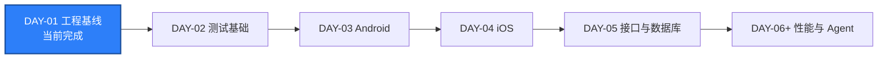

# DAY-01 - 工程基线初始化 / Project Baseline Initialization

- 日期 / Date: 2026-09-25 15:02:21 +08:00
- 分支 / Branch: main
- 基线提交 / Base Commit: 无，Day 1 为根提交 / none, root commit
- 当日提交 / Day Commit: 8bf7ef7
- 状态 / Status: 完成并补充记录 / COMPLETE, historical backfill

## 完成状态 / Completion Status

通过 / PASSED: Git、Python 3.12、uv、PyCharm 解释器、忽略规则和 Agent 契约均已建立。

English: Git, Python 3.12, uv, the PyCharm interpreter, ignore rules, and the
agent operating contract were initialized and verified.

## 完成范围 / Scope

Day 1 的目标不是写业务测试，而是建立唯一可信的工程基线：

- 初始化 Git 仓库，默认分支为 `main`。
- 创建 `pyproject.toml`，固定 Python `>=3.12,<3.13`。
- 创建 `.python-version`，锁定 Python 3.12。
- 创建 `uv.toml`，将 uv 缓存放在项目内 `.uv/cache`。
- 创建项目 `.venv`，使用 CPython 3.12.14。
- 创建 `.gitignore`，排除 IDE、虚拟环境、缓存、Secret、日志和生成物。
- 创建 `AGENTS.md`，定义 Agent 权限、安全和验证规则。
- 创建 `ai/` 目录骨架，为后续 Prompt、Policy、Tool、Eval 和 Knowledge 做准备。
- 创建 `docs/GOALS.md` 和 `docs/PLAN.md`。
- 创建第一次 Git 基线提交 `8bf7ef7`。
- 在 PyCharm 中绑定项目 `.venv`，并验证 SDK 路径。

English summary: created the repository baseline and a project-local Python
environment without relying on the broken Windows Store Python placeholder.

## 术语解释 / Glossary

| 名词 / Term | 简单解释 / Plain Meaning | 作用 / Purpose | 在本项目中的位置 / Position |
| --- | --- | --- | --- |
| Git | 记录代码每次变化的版本管理工具 | 知道谁在什么时候改了什么，也能回退错误修改 | 整个项目的地基，Day 1 开始使用 |
| Repository | Git 管理的项目仓库 | 保存代码、配置、测试和提交历史 | `D:\Codex projects\Appium 2 study` |
| Commit | 一次被 Git 记录的完整改动快照 | 形成可回退、可比较、可追踪的检查点 | Day 1 的 `8bf7ef7` |
| Python 虚拟环境 | 属于当前项目的独立 Python 运行空间 | 避免不同项目互相污染依赖 | 项目根目录的 `.venv` |
| uv | Python 环境和依赖管理工具 | 快速创建环境、安装依赖并锁定版本 | 管理 `.venv` 和 `uv.lock` |
| `pyproject.toml` | Python 项目的标准配置入口 | 声明 Python 版本、依赖、pytest、Ruff 和 mypy 配置 | 项目根目录 |
| Lock File | 记录依赖精确版本的锁文件 | 保证本机、PyCharm 和 CI 安装相同版本 | `uv.lock` |
| Interpreter | 实际执行 Python 代码的程序 | 决定测试使用哪套 Python 和依赖 | `.venv\Scripts\python.exe` |
| `AGENTS.md` | Agent 的操作契约和边界 | 告诉 Agent 哪些操作允许、哪些禁止 | 项目根目录 |

简单理解：Day 1 像建造房屋前先确认地基、水电和门禁，还没开始装修测试框架。

## 今日在整体路线中的位置 / Day Position



Day 1 是后续所有工作的唯一环境起点。没有统一解释器、锁文件和 Git 基线，后面即使测试通过，也无法保证在 PyCharm、终端和 CI 中结果一致。

## 质量检查 / Quality Checks

| 检查项 / Check | 结果 / Status | 证据 / Evidence |
| --- | --- | --- |
| Git repository | 通过 / PASS | 根提交 `8bf7ef7 chore: initialize project baseline` |
| Python runtime | 通过 / PASS | CPython 3.12.14 |
| Project `.venv` | 通过 / PASS | `.venv\Scripts\python.exe` |
| uv lock | 通过 / PASS | `uv lock --check` 返回 `Resolved 1 package` |
| Ignore rules | 通过 / PASS | `.idea`、`.uv`、`.uv-cache`、`.venv` 均被忽略 |
| PyCharm SDK | 通过 / PASS | `Python 3.12 (Appium 2 study)` |
| Pytest/Ruff/Mypy | 不适用 / N/A | Day 2 才安装测试工具 |

## 验收方式 / Acceptance Method

以下命令在 PyCharm Terminal 或 Windows PowerShell 中，于项目根目录执行。

```powershell
Set-Location 'D:\Codex projects\Appium 2 study'

git show --stat --format=fuller 8bf7ef7
git show 8bf7ef7:.python-version
git show 8bf7ef7:pyproject.toml
git show 8bf7ef7:uv.lock

.\.venv\Scripts\python.exe --version
.\.venv\Scripts\python.exe -c "import sys; print(sys.executable)"

uv lock --check
git status --short --branch --ignored
```

预期结果 / Expected results:

```text
8bf7ef7 chore: initialize project baseline
3.12
requires-python = ">=3.12,<3.13"
Day 1 原始 uv.lock 只包含初始项目元数据
Python 3.12.14
D:\Codex projects\Appium 2 study\.venv\Scripts\python.exe
Resolved <N> packages
## main
!! .idea/
!! .uv/
!! .uv-cache/
!! .venv/
```

关键验收行 / Key acceptance lines:

```text
8bf7ef7
Python 3.12.14
.venv\Scripts\python.exe
requires-python = ">=3.12,<3.13"
Resolved
## main
```

## 交付物 / Deliverables

- Git 根提交 / Git root commit: `8bf7ef7`
- 工程配置 / Project configuration: `pyproject.toml`、`.python-version`、`uv.toml`
- 忽略规则 / Ignore rules: `.gitignore`
- Agent 契约 / Agent contract: `AGENTS.md`
- AI 目录骨架 / AI directory skeleton: `ai/`
- 项目目标 / Goals: `docs/GOALS.md`
- 执行计划 / Plan: `docs/PLAN.md`
- Python 环境 / Python environment: `.venv`

## 环境 / Environment

- Git: 2.53.0.windows.1
- Python: 3.12.14
- uv: 0.10.10
- 虚拟环境 / Virtual environment: `.venv`
- uv 缓存 / uv cache: `.uv/cache`
- PyCharm SDK: `Python 3.12 (Appium 2 study)`
- PyCharm SDK 路径 / SDK path:
  `D:\Codex projects\Appium 2 study\.venv\Scripts\python.exe`

## 风险与限制 / Risks and Limitations

- 系统 `python.exe` 是失效的 Windows Store 占位符，因此必须使用项目 `.venv`。
- Day 1 尚未安装 pytest、Allure、Ruff 和 mypy，因此没有测试质量门禁。
- 当时 Node.js 16 和 Java 8 不满足 Appium 2 环境要求；该问题已在 Day 3 修复。
- PyCharm Black 配置当时仍指向 Python 3.14；项目解释器正确，该配置在 Day 2 修复。
- 当时尚未配置 Git `origin`，无法执行远端 PR 流程。

## 下一步 / Next Day

- 安装 pytest、Allure、HTTP Client、Pydantic、psycopg 和 Redis Client。
- 创建基础项目目录。
- 建立第一条单元测试和第一条 Smoke 测试。
- 配置 PyCharm pytest Run Configuration。
