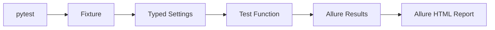

# DAY-02 - 类型化配置与 Smoke 基线 / Typed Configuration and Smoke Baseline

- 日期 / Date: 2026-09-26
- 分支 / Branch: main
- 基线提交 / Base Commit: 8bf7ef7
- 当日提交 / Day Commits: 5f45d92, 7132b98, edb7c18
- 状态 / Status: 完成 / COMPLETE

## 完成范围 / Scope

本日完成质量工程平台的最小可执行基线：

- 增加 HTTP、类型化配置、YAML、日志、PostgreSQL 和 Redis 运行时依赖。
- 增加 pytest、Allure、并行、超时、重跑、Ruff 和 mypy 开发依赖。
- 建立 `qa_core.config` 包和类型化 `Settings`。
- 建立第一条单元测试和第一条 Smoke 测试。
- 生成第一份 Allure HTML 报告。
- 修复 PyCharm pytest Run Configuration。
- 在 `.venv` 中补充 pip，使 PyCharm 能识别测试依赖。

English summary: created the initial typed configuration and smoke-test baseline,
then verified pytest, Ruff, mypy, Allure, and PyCharm package detection.

## 术语解释 / Glossary

| 名词 / Term | 简单解释 / Plain Meaning | 作用 / Purpose | 在本项目中的位置 / Position |
| --- | --- | --- | --- |
| pytest | Python 的自动化测试运行器 | 发现测试、执行测试、判断通过或失败 | 所有单元、API、Appium 和 E2E 测试的入口 |
| Test Function | 名称以 `test_` 开头的测试函数 | 表达一个可独立执行的检查 | `tests/` 下的测试文件 |
| Unit Test | 不依赖外部服务的快速小测试 | 验证配置、算法和纯函数是否正确 | `tests/unit/` |
| Smoke Test | 只检查最关键链路是否可用的测试 | 快速判断环境是否具备继续工作的条件 | `tests/smoke/` |
| Fixture | pytest 提供的测试前置和后置资源 | 创建配置、Driver、数据库连接并负责清理 | `tests/conftest.py` |
| Marker | 给测试加标签，例如 `smoke`、`android` | 按类别选择测试，不必运行全部用例 | `pyproject.toml` |
| Allure | 测试报告和证据可视化工具 | 展示步骤、结果、附件和历史 | `artifacts/allure-report` |
| Pydantic | 用 Python 类型描述和校验数据的库 | 防止配置字段类型错误 | `qa_core.config.settings` |
| Ruff | Python 代码检查和格式质量工具 | 尽早发现导入、语法和常见代码问题 | 本地质量门禁和 CI |
| mypy | Python 类型检查工具 | 在运行前发现类型不匹配 | 本地质量门禁和 CI |

简单理解：Day 1 建好了房子，Day 2 装上了“测试插座”和“报警器”。

## 今日在整体路线中的位置 / Day Position


Day 2 建立了后续所有测试共用的执行入口和数据校验方式：



## 质量检查 / Quality Checks

| 检查项 / Check | 结果 / Status | 证据 / Evidence |
| --- | --- | --- |
| Ruff | 通过 / PASS | `All checks passed` |
| Mypy | 通过 / PASS | `Success: no issues found in 9 source files` |
| Pytest | 通过 / PASS | `4 passed in 0.09s` |
| Allure results | 通过 / PASS | `artifacts/allure-results` 已生成 |
| Allure HTML | 通过 / PASS | `artifacts/allure-report/index.html` 已生成 |
| PyCharm package detection | 通过 / PASS | `packaging_tool.py list` 能返回 pytest 和 allure-pytest |

## 验收方式 / Acceptance Method

前置条件：使用项目 `.venv`，工作目录为项目根目录。

```powershell
.\.venv\Scripts\python.exe --version
.\.venv\Scripts\python.exe -m pip --version
.\.venv\Scripts\python.exe -m pytest tests/unit tests/smoke -q --alluredir=artifacts/allure-results
.\.venv\Scripts\python.exe -m ruff check .
.\.venv\Scripts\python.exe -m mypy packages tests
allure generate artifacts/allure-results --clean -o artifacts/allure-report
```

预期结果 / Expected results:

```text
Python 3.12.14
pip 25.0.1
4 passed
All checks passed
Success: no issues found in 9 source files
Report successfully generated
```

证据路径 / Evidence:

- `reports/daily/DAY-02.md`
- `artifacts/allure-results`
- `artifacts/allure-report/index.html`

## 变更文件 / Files Changed

- `.env.example`
- `packages/qa_core/__init__.py`
- `packages/qa_core/config/__init__.py`
- `packages/qa_core/config/settings.py`
- `tests/conftest.py`
- `tests/unit/test_settings.py`
- `tests/smoke/test_environment.py`
- `pyproject.toml`
- `uv.lock`
- `AGENTS.md`

## 环境 / Environment

- Python: 3.12.14
- 虚拟环境 / Virtual environment: `.venv`
- 包管理 / Package manager: uv
- PyCharm SDK: `Python 3.12 (Appium 2 study)`
- pip: 25.0.1

## 风险与限制 / Risks and Limitations

- PyCharm 2025.3 Python 插件在测试设置界面记录过内部 EDT 异常；项目代码、pytest 和 Allure 不受影响。
- 当时尚未配置 Git `origin`，因此无法验证 PR 创建。
- 当时 GitHub CLI token 无效。
- Day 2 结束时 Node.js 16 和 Java 8 仍是 Day 3 的环境阻塞；该问题后来在 Day 3 已解决。
- 当前网络对 PyPI/CDN 不稳定，后续本地命令可使用 `uv run --no-sync` 或直接调用 `.venv`。

## 下一步 / Next Day

- 安装并验证 Node.js LTS、JDK 17 或更高版本及 Android Platform Tools。
- 安装 Appium 2 和 UiAutomator2 Driver。
- 创建并启动 Android AVD。
- 创建并调试第一条 Android Appium Session。
