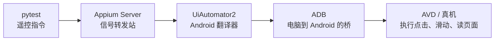
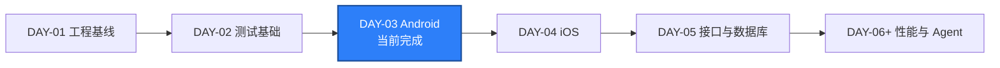
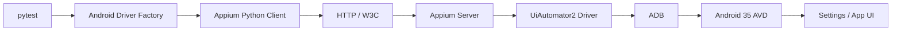

# DAY-03 - Android Appium 环境与最小 Session / Android Appium Environment and Minimal Session

- 日期 / Date: 2026-09-27
- 分支 / Branch: main
- 基线提交 / Base Commit: edb7c18
- 当日提交 / Day Commits: 90ba602, b250abb, 808fa15
- 远程仓库 / Remote: 未配置 / not configured

## 完成状态 / Completion Status

通过 / PASSED: 自动化质量检查和真实 Android Session 均已通过。

English: automated quality checks and a real Android Appium session passed.

## 完成范围 / Scope

本日完成 Android Appium 最小闭环：

- 安装并验证 JDK 21 兼容运行时、Android CLI、Platform 35、Build Tools 35 和 AOSP ATD 模拟器。
- 安装并验证 Appium 2.19.0、UiAutomator2 Driver 4.2.9、Appium Python Client 5.3.1 和 Selenium 4.49.0。
- 创建 Android 35 Pixel 6 AVD，并验证 `sys.boot_completed=1`。
- 启动 Appium Server，并验证 `/status ready=true`。
- 建立 Android Driver Factory 和真实 Android Session Smoke Test。
- 验证 AOSP ATD 的 launcher 为 `com.android.fakesystemapp/.launcher.EmptyHomeActivity`。
- 修复 Appium URL 尾斜杠导致 `POST //session` 404 的问题。

English summary: completed the Android Appium environment, driver factory,
real emulator session lifecycle, Allure evidence, and PyCharm run configuration.

## 术语解释 / Glossary

| 名词 / Term | 简单解释 / Plain Meaning | 作用 / Purpose | 在本项目中的位置 / Position |
| --- | --- | --- | --- |
| Appium | 使用统一 WebDriver 协议控制移动 App 的工具 | 让 Python 测试能够操作 Android 和 iOS | 移动端自动化总入口 |
| Appium Client | Python 测试代码侧发送命令的库 | 把 Python 调用转换成 Appium HTTP 请求 | `Appium-Python-Client` |
| Appium Server | 接收命令并调度设备 Driver 的服务 | 连接测试代码、Driver 和设备 | `http://127.0.0.1:4723` |
| Driver | 负责某一种平台技术的适配层 | 把统一命令转换成 Android 或 iOS 原生操作 | Android 使用 UiAutomator2 |
| UiAutomator2 | Android 官方 UI 自动化和元素定位框架 | 查找元素、点击、滑动并读取页面状态 | `appium-uiautomator2-driver` |
| Capabilities | 告诉 Appium“要控制哪台设备、哪个 App、怎样启动”的参数字典 | 决定 session 的目标设备和 App | `qa_core.driver.android` |
| Session | 一次 Appium 自动化连接的生命周期 | 从创建到退出期间保存设备状态和命令上下文 | 每条 Android 测试 |
| ADB | Android Debug Bridge，电脑与 Android 设备通信的桥梁 | 安装 APK、启动 Activity、查看日志和执行设备命令 | `D:\Android\Sdk\platform-tools\adb.exe` |
| AVD | Android Virtual Device，安卓模拟器实例 | 不用真机也能执行 Android 自动化 | `Pixel_API_35_AOSP_ATD` |
| AOSP ATD | Google 官方面向自动化的精简测试镜像 | 启动更快，适合 CI 和基础自动化 | Android 35 系统镜像 |
| `io.appium.settings` | Appium 安装到设备上的辅助 App | 协助处理通知、权限和系统设置 | 由 UiAutomator2 Driver 管理 |

简单理解：Day 1 是地基，Day 2 是测试插座，Day 3 是第一台真正通电运行的 Android 机器。

## 通俗解读 / Plain-Language Guide

Day 3 像给 Windows 装了一套“Android 遥控器”：pytest 按键，Appium Server 转发命令，
UiAutomator2 翻译成 Android 操作，ADB 把命令送到模拟器，最后由 AVD 执行点击和读取页面。

**一句话理解：** 你写的是 Python 测试，真正动手的是 Android 模拟器。



## 今日在整体路线中的位置 / Day Position



Android 自动化调用链：



`io.appium.settings` 失败发生在 `Appium Server -> UiAutomator2 Driver -> ADB -> AVD` 这段初始化链路中，不是 pytest 断言或业务代码问题。

## 质量检查 / Quality Checks

| 检查项 / Check | 结果 / Status | 证据 / Evidence |
| --- | --- | --- |
| Ruff | 通过 / PASS | `All checks passed!` |
| Mypy | 通过 / PASS | `Success: no issues found in 13 source files` |
| Pytest | 通过 / PASS | `5 passed` |
| Android Session | 通过 / PASS | Android test `1 passed` |
| Allure report | 通过 / PASS | `artifacts/allure-report/index.html` |
| AVD boot | 通过 / PASS | `sys.boot_completed=1` |
| Appium status | 通过 / PASS | Appium 2.19.0，`ready=true` |

## 验收方式 / Acceptance Method

前置条件 / Precondition：先启动 AVD 和 Appium Server，并保持两个终端标签页运行。

```powershell
& 'D:\Android\Sdk\emulator\emulator.exe' `
  -avd Pixel_API_35_AOSP_ATD `
  -no-window -no-audio -no-boot-anim -no-snapshot

.\scripts\wait_for_android_ready.ps1 -Serial emulator-5554

appium --address 127.0.0.1 --port 4723 --log-level debug
```

执行验收命令 / Run acceptance commands:

```powershell
git status --short --branch

& 'D:\Android\Sdk\platform-tools\adb.exe' `
  -s emulator-5554 shell getprop sys.boot_completed

Invoke-RestMethod `
  -Uri 'http://127.0.0.1:4723/status' `
  -TimeoutSec 10

uv run --no-sync pytest tests/android -q `
  --alluredir=artifacts/allure-results

uv run --no-sync pytest -q
```

预期结果 / Expected results:

```text
Git worktree clean
sys.boot_completed = 1
Appium /status ready = true
Android test: 1 passed
Full suite: 5 passed
```

证据路径 / Evidence:

- `reports/daily/DAY-03.md`
- `artifacts/allure-report/index.html`
- `artifacts/emulator.out.log`
- `artifacts/appium-server.out.log`

## 交付物 / Deliverables

- Android Driver Factory: `packages/qa_core/driver/android.py`
- Android Session Smoke Test: `tests/android/test_session.py`
- Android 配置: `packages/qa_core/config/settings.py`
- 环境模板: `.env.example`
- 依赖和锁文件: `pyproject.toml`、`uv.lock`
- PyCharm 运行配置: `Android Tests`

English: Android driver factory, session smoke test, typed Android settings,
locked dependencies, and a PyCharm pytest run configuration are included.

## 备注 / Notes

- 首次安装最新 UiAutomator2 Driver 失败，因为最新版要求 Appium 3；项目固定 Appium 2，因此安装兼容版本 4.2.9。
- PyPI/CDN 多次 TLS 中断，因此使用官方 wheel、SHA-256 校验和离线安装作为网络受限时的恢复路径。
- Appium 日志中曾出现 `Cannot start the 'io.appium.settings' application`。根因是 AVD 冷启动后 Android `settings`/Package Manager 服务尚未完全就绪，不是业务代码或 Driver 缺陷。当前状态已确认 `Service package: found`、`Service settings: found`、`init.svc.bootanim: stopped`，并新增 `wait_for_android_ready.ps1` 防止复发。
- 判断当前状态时应看最新 `POST /session 200`、`session created successfully` 和 pytest 结果，不能只看 `tail` 中的旧错误。
- 临时 SDK 压缩包、metadata 和 wheel 镜像已删除，`.tmp-*` 已加入忽略规则。

English notes: latest UiAutomator2 required Appium 3; version 4.2.9 was selected
for Appium 2. Temporary downloads were verified, removed, and ignored.

## 命令输出 / Command Output

### Ruff

```text
All checks passed!
```

### Mypy

```text
Success: no issues found in 13 source files
```

### Pytest

```text
.....                                                                    [100%]
5 passed
```

### Allure report

```text
Report successfully generated to artifacts\allure-report
```

## 风险与未验证项 / Risks and Unverified Items

- GitHub `origin` 未配置，PR 创建流程无法验证。
- GitHub CLI token 无效，需要执行 `gh auth login` 后重新验证。
- 当前网络对 PyPI/CDN 不稳定，本地可使用 `uv run --no-sync`；CI 或网络恢复后应执行 `uv sync --frozen`。

English: remote PR creation and GitHub CLI authentication remain unverified.
The local environment works with the locked project `.venv`.

## 下一步 / Next Day

- 准备 macOS CI、Mac 工作站或 iOS 设备云。
- 在 macOS 环境安装 XCUITest Driver 和 WebDriverAgent。
- 启动 iOS Simulator。
- 创建 iOS 最小 Session 并记录 WDA 调用链。
- 让只读 Agent 分析一次 Android/iOS Driver 创建差异。
