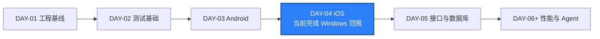
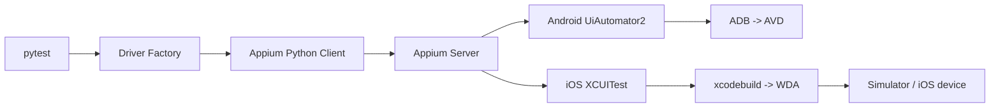

# DAY-04 - iOS XCUITest 环境准备与最小 Session 实验 / iOS XCUITest Environment and Minimal Session Experiment

- 日期 / Date: 2026-09-27
- 分支 / Branch: main
- 基线提交 / Base Commit: cfe8018
- 远程仓库 / Remote: 未配置 / not configured
- 完成状态 / Status: Windows 可验证范围通过，macOS 真实 Session 待验证 / PARTIAL

## 完成状态 / Completion Status

通过 / PASSED（Windows 可验证范围）：类型化 iOS 配置、XCUITest
Options、非 macOS 自动跳过、Appium XCUITest Driver 安装、预检脚本、CI
工作流和调用链分析均已完成。

待验证 / PENDING（macOS 范围）：Xcode 编译 WebDriverAgent、启动 iOS
Simulator、创建真实 XCUITest Session 和退出 Session 必须在 macOS、macOS CI
或设备云执行。

English: all Windows-verifiable work passed. WDA compilation and a real
XCUITest session remain unverified because the current host is Windows.

## 完成范围 / Scope

- 确认 Appium 2.19.0 兼容 XCUITest Driver 8.4.3。
- 安装 `appium-xcuitest-driver@8.4.3`，并在 Appium Driver 清单中验证已安装。
- 增加 iOS Device、runtime、UDID、bundle ID、WDA 端口和 WDA 重建配置。
- 建立 `qa_core.driver.ios`，输出类型化 `XCUITestOptions` 和 Appium session。
- 建立 `tests/ios/test_session.py`；非 macOS 环境明确跳过，不伪造通过。
- 增加只读环境预检：macOS、Xcode、Simulator runtime、Appium 和 XCUITest Driver。
- 增加 Simulator 选择器，优先选择指定设备，失败时回退到 iPhone。
- 增加 iOS Simulator/Device Cloud runbook 和 Android/iOS Driver 调用链对比。
- 增加手工触发的 macOS GitHub Actions Smoke 工作流。
- 完成一次只读 Agent 分析，记录 iOS 与 Android Driver 创建差异。

English summary: added the iOS driver factory, typed settings, skip-safe session
smoke, environment preflight, Simulator selector, runbook, call-chain analysis,
and a manual macOS CI workflow.

## 术语解释 / Glossary

| 名词 / Term | 简单解释 / Plain Meaning | 作用 / Purpose | 在本项目中的位置 / Position |
| --- | --- | --- | --- |
| iOS Simulator | Mac 上的虚拟 iPhone 运行环境 | 不依赖真机运行和调试 iOS App | 第一条 iOS session 的目标设备 |
| Xcode | Apple 的 iOS 开发工具套件 | 提供 SDK、编译器、Simulator 和命令行工具 | macOS 上的 iOS 基础环境 |
| `xcode-select` | 选择当前 Xcode 命令行工具路径的工具 | 保证 `xcrun` 和编译器指向正确 Xcode | 环境预检 |
| `xcrun simctl` | 通过命令行管理 Simulator 的工具 | 列出、启动和检查模拟器 | Simulator 预检与启动 |
| XCUITest | Apple 原生 iOS UI 自动化测试框架 | 通过 XCTest 驱动真实 App UI | Appium iOS Driver 的核心 |
| XCUITest Driver | Appium 对 XCUITest 和 WDA 的适配层 | 将 WebDriver 命令转换成 iOS 自动化操作 | `appium-xcuitest-driver` |
| WebDriverAgent / WDA | 运行在 iOS 设备或 Simulator 上的自动化服务 | 接收 XCUITest 命令并操作 App | XCUITest Driver 的核心运行组件 |
| `WebDriverAgentRunner` | WDA 的 XCTest 测试运行器 | 启动 WDA 并保持 session 可通信 | iOS 设备端执行入口 |
| DerivedData | Xcode 保存构建中间产物和缓存的目录 | WDA 构建失败时常需检查或隔离 | Xcode/WDA 诊断 |
| `bundleId` | iOS App 的唯一标识 | 告诉 Appium 要操作哪个 App | `QA_IOS_BUNDLE_ID` |
| `wdaLocalPort` | 主机与 WDA 通信使用的本地端口 | 并行 Simulator 时避免端口冲突 | `QA_IOS_WDA_LOCAL_PORT` |
| macOS CI | 在云 macOS Runner 上执行任务的流水线 | 没有本地 Mac 时运行 WDA 和 Simulator | `.github/workflows/ios-smoke.yml` |
| Device Cloud | 提供远程真机或 Simulator 的服务 | 扩展设备覆盖并减少本地硬件依赖 | 后续 iOS 设备矩阵路径 |

简单理解：Android 的 session 依赖 ADB 和 UiAutomator2；iOS 的 session
依赖 Xcode 编译 WDA，再把 WDA 启动到 Simulator 或真机。

## 今日在整体路线中的位置 / Day Position



Android 与 iOS 的最小 session 调用链：



当前 Windows 环境只能完成 `pytest -> Factory -> Client -> Appium Server`。
继续进入 `Xcode -> WDA -> Simulator` 必须切换到 macOS。

## 质量检查 / Quality Checks

| 检查项 / Check | 结果 / Status | 证据 / Evidence |
| --- | --- | --- |
| Ruff | 通过 / PASS | `All checks passed!` |
| Mypy | 通过 / PASS | `Success: no issues found in 17 source files` |
| 非设备测试 / non-Android tests | 通过 / PASS | `6 passed, 1 skipped, 1 deselected` |
| iOS skip 行为 / iOS skip behavior | 通过 / PASS | `XCUITest requires macOS, Xcode, and WebDriverAgent.` |
| Appium version | 通过 / PASS | `2.19.0` |
| XCUITest Driver | 通过 / PASS | `xcuitest@8.4.3`，兼容 `appium ^2.5.4` |
| iOS 预检 / iOS preflight | 预期失败 / EXPECTED FAIL | Appium/Driver 通过；macOS/Xcode/Simulator 缺失 |
| Allure report | 通过 / PASS | `artifacts/allure-report/index.html` |
| macOS 真实 Session | 未验证 / UNVERIFIED | 当前主机不是 macOS |

## 验收方式 / Acceptance Method

### Windows 可验证命令

```powershell
appium --version

appium driver list --installed --json

uv run --no-sync python scripts/check_ios_environment.py --json

uv run --no-sync pytest -q -m "not android" `
  --alluredir=artifacts/allure-results

.\.venv\Scripts\python.exe -m ruff check .
.\.venv\Scripts\python.exe -m mypy packages tests

$env:ALLURE_NO_ANALYTICS = "true"
allure generate artifacts/allure-results --clean -o artifacts/allure-report
```

预期结果 / Expected results:

```text
Appium 2.19.0
xcuitest@8.4.3 installed
iOS environment ready: False on Windows
6 passed, 1 skipped, 1 deselected
All checks passed!
Success: no issues found in 17 source files
Report successfully generated
```

预检返回非零不是测试缺陷。`passed=false` 明确证明当前阻塞边界是 macOS、
Xcode 和 Simulator，而不是 Appium 或 XCUITest Driver 安装。

### macOS 待执行命令

完整步骤见 `docs/runbooks/ios-xcuitest-simulator.md`。

```bash
uv sync --frozen
npm install --global appium@2.19.0
appium driver install xcuitest@8.4.3
uv run --no-sync python scripts/check_ios_environment.py --doctor
appium --address 127.0.0.1 --port 4723 --log-level debug
uv run --no-sync pytest tests/ios -q \
  --alluredir=artifacts/allure-results
```

通过标准 / Pass criteria:

```text
iOS environment ready: True
Appium /status ready=true
POST /session 200
WDA build succeeded
WebDriverAgentRunner launched
1 passed
```

证据路径 / Evidence:

- `reports/daily/DAY-04.md`
- `docs/runbooks/ios-xcuitest-simulator.md`
- `docs/architecture/mobile-driver-call-chain.md`
- `artifacts/allure-report/index.html`
- macOS 执行后应保存 Appium、Xcode/WDA 和 Allure 日志

## 交付物 / Deliverables

- iOS Driver Factory: `packages/qa_core/driver/ios.py`
- iOS Session Smoke: `tests/ios/test_session.py`
- iOS Options 单元测试: `tests/unit/test_ios_driver_options.py`
- iOS 类型化配置: `packages/qa_core/config/settings.py`
- iOS 环境变量模板: `.env.example`
- iOS 预检脚本: `scripts/check_ios_environment.py`
- Simulator 选择脚本: `scripts/select_ios_simulator.py`
- iOS Runbook: `docs/runbooks/ios-xcuitest-simulator.md`
- Driver 调用链分析: `docs/architecture/mobile-driver-call-chain.md`
- 手工 macOS CI: `.github/workflows/ios-smoke.yml`

## Agent 只读分析结论 / Read-only Agent Findings

1. Android 与 iOS 的 Python/Appium Server 边界相同，可以共享配置、日志和
   session 生命周期接口。
2. Android 在 Windows 上具备完整宿主能力；iOS 在 Windows 上只能安装
   Appium Driver，不能构建和运行 WDA。
3. 平台 capability、端口和设备选择应留在 Driver Factory，不应散落到业务
   测试。后续跨平台阶段由 `PlatformAdapter` 统一生命周期和诊断。
4. `import XCUITestOptions` 成功只证明 Python Client 和 Options 类可加载，
   不能证明 Xcode、WDA、Simulator 和 bundleId 能形成真实 session。
5. 真实通过证据必须来自 `POST /session 200`、WDA 构建结果、Simulator 状态
   和 pytest；静态代码检查只能证明配置结构正确。

## 已知限制 / Known Limitations

- 当前主机为 Windows，没有 Xcode、`xcrun` 和 iOS Simulator runtime。
- 真实 XCUITest Session、WDA 构建、Simulator 启动和退出均未验证。
- Device Cloud 账号、endpoint 和凭证未提供，因此未实现供应商 Adapter。
- `.github/workflows/ios-smoke.yml` 已做 YAML 解析验证，但没有推送到远端，
  也没有实际运行 macOS Runner。
- `actionlint` 未安装，工作流未做专用 lint。
- Windows 上 `appium driver doctor xcuitest` 必然报告 Xcode、`xcrun` 和
  macOS 环境缺失；该结果不能作为 Driver 安装失败判断。
- Android 设备测试仍要求 AVD 已启动，因此 Day 4 使用
  `-m "not android"` 验证所有非设备测试。

## 下一步 / Next Day

- 在 macOS、macOS CI 或设备云执行 iOS 最小 session，并补齐真实证据。
- 创建 Docker Compose SUT。
- 验证 API、PostgreSQL 和 Redis。
- 使用 `psql` 验证 Schema、种子数据和只读查询。
- 建立健康检查和 SUT 启动脚本。
