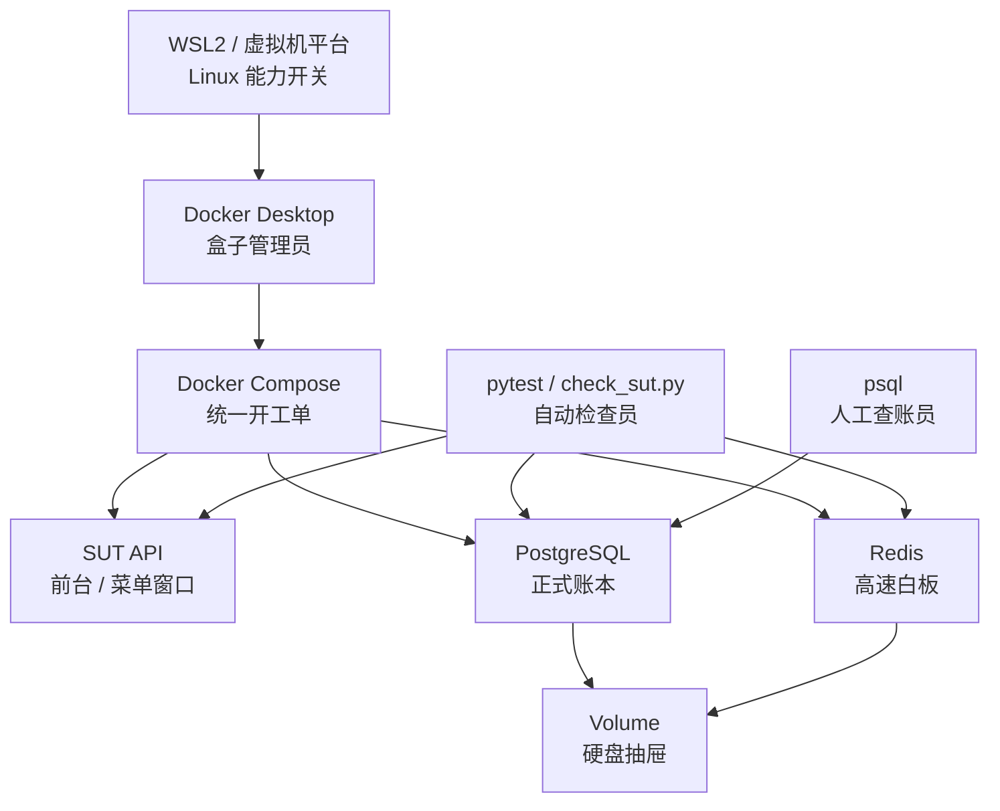
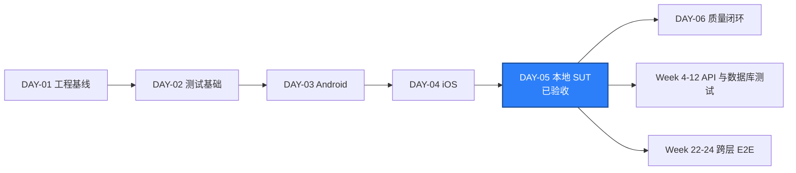
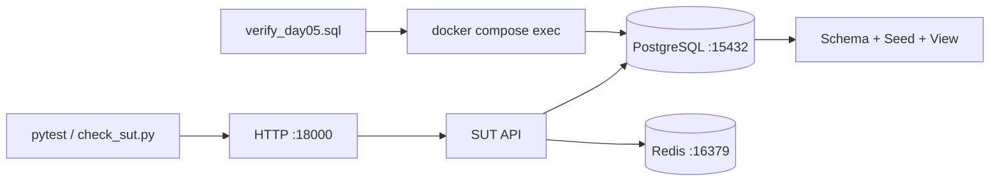

# DAY-05 - 本地 SUT、PostgreSQL 与 Redis / Local SUT, PostgreSQL, and Redis

- 日期 / Date: 2026-09-30
- 分支 / Branch: main
- 基线提交 / Base Commit: 4f5f297
- 当日提交 / Day Commit: 尚未提交 / not committed
- 完成状态 / Status: 通过 / PASSED

## 完成状态 / Completion Status

Compose SUT、API、PostgreSQL、Redis、`psql` 和集成测试均已完成真实正向验收。
Docker Desktop 4.93.0、WSL 2.7.13 和 Docker engine 29.8.1 正常工作，三个容器
均为 `healthy`，停止后保留 volume 再次启动仍保持正确 Schema 和种子数据。

English: the local SUT completed real positive acceptance. Docker Desktop
4.93.0, WSL 2.7.13, and Docker engine 29.8.1 are working. API, PostgreSQL, and
Redis are healthy, schema/seed checks pass, and a stop/start cycle preserves the
expected state.

## 完成范围 / Scope

- 建立 `apps/compose/compose.yaml`，编排只读 SUT API、PostgreSQL 16 和 Redis 7。
- 建立 PostgreSQL Schema、种子数据和只读汇总视图。
- 建立 `scripts/start_sut.ps1`、`stop_sut.ps1` 和 `verify_sut_database.ps1`。
- 建立 `scripts/check_sut.py`，检查 API live/ready、种子目录、PostgreSQL 和 Redis。
- 建立 4 条 Docker Compose 集成测试；未启动栈时明确 skip。
- 建立 Ubuntu GitHub Actions 工作流，独立执行 Compose、`psql` 和集成测试。
- 将本地宿主机端口改为 `18000/15432/16379`，避开本机已有的 Redis 6379。
- 建立本地 SUT Compose runbook。
- 下载并验证 Docker Desktop 4.93.0 官方安装包，数字签名状态为 `Valid`。
- 安装 Docker Desktop，`com.docker.service` 已注册并处于运行状态。
- 启用 `Microsoft-Windows-Subsystem-Linux` 和 `VirtualMachinePlatform`。
- 离线安装 Microsoft WSL 2.7.13；包签名有效且 SHA-256 与官方 winget 元数据一致。
- 使用 `wsl --install --no-distribution` 完成 VirtualMachinePlatform 注册，
  DISM 返回成功并要求再次重启。
- 在 Windows 代理阻断 Docker daemon 时，将 Docker Desktop `ProxyHTTPMode`
  切换为 `disabled`，通过可访问镜像站拉取并重标记三个基础镜像。
- 完成容器健康检查、只读 `psql`、4 条集成测试、停止/重启和 Allure 验收。

English summary: added a containerized local SUT, database schema and seed,
read-only verification, health checks, integration tests, and CI. The complete
Compose path is verified locally on Windows with WSL2.

## 术语解释 / Glossary

| 名词 / Term | 简单解释 / Plain Meaning | 作用 / Purpose | 在本项目中的位置 / Position |
| --- | --- | --- | --- |
| SUT | System Under Test，被测系统 | 隔离“被测对象”和测试代码 | `apps/compose/api` |
| Docker Compose | 用声明文件启动多个关联容器的工具 | 一条命令启动 API、数据库和缓存 | `apps/compose/compose.yaml` |
| PostgreSQL | 开源关系型数据库 | 保存业务状态、约束和 Schema | `postgres` 服务，宿主机 `15432` |
| Redis | 内存数据结构服务 | 缓存、会话、限流和临时状态 | `redis` 服务，宿主机 `16379` |
| Init Script | 数据库卷首次创建时执行的 SQL | 自动建立 Schema 和种子数据 | `postgres/init/*.sql` |
| Seed Data | 可重复使用的初始测试数据 | 让测试有稳定、已知的业务前提 | 2 个 workspace、3 个用户、4 个商品 |
| Health Check | 判断服务是否可接收工作的检查 | Compose 等待依赖真正就绪 | `/health/live`、`/health/ready` |
| Readiness | 服务及关键依赖是否都可工作 | 避免 API 启动但数据库未就绪 | API readiness endpoint |
| DSN | Data Source Name，数据库连接字符串 | 统一描述主机、端口、用户和数据库 | `QA_POSTGRES_DSN` |
| `psql` | PostgreSQL 官方命令行客户端 | 执行 Schema、种子和只读验收查询 | PostgreSQL 容器内 |
| Read-only Transaction | 禁止写入的事务模式 | 降低误改测试数据库的风险 | `verify_day05.sql` |
| Volume | 容器删除后仍保留数据的存储 | 保留 PostgreSQL 和 Redis 本地数据 | `postgres-data`、`redis-data` |

简单理解：Day 3 和 Day 4 分别打通移动端设备入口；Day 5 建立后续 API、数据库和
缓存测试共用的本地服务地基。

## 通俗解读 / Plain-Language Guide

Day 5 像在电脑里搭一个测试餐厅：Docker 是盒子管理员，Compose 是开工单，
API 是前台，PostgreSQL 是正式账本，Redis 是高速白板，Volume 是不会随盒子
重启丢失的硬盘抽屉，pytest 和 `psql` 是两类检查员。

**一句话理解：** 这套环境让后续 API、数据库、缓存和移动端测试都有一个稳定、
可重复启动、可以随时检查的本地被测系统。



## 今日在整体路线中的位置 / Day Position



本地调用链：



## 质量检查 / Quality Checks

| 检查项 / Check | 结果 / Status | 证据 / Evidence |
| --- | --- | --- |
| Ruff | 通过 / PASS | `All checks passed!` |
| Mypy | 通过 / PASS | `Success: no issues found in 19 source files` |
| Unit + Smoke + Integration | 通过 / PASS | `10 passed in 0.51s` |
| SUT health checker | 通过 / PASS | API、PostgreSQL、Redis 和 seed 全部 `passed=true` |
| Compose services | 通过 / PASS | API、PostgreSQL、Redis 均为 `healthy` |
| `psql` schema/seed | 通过 / PASS | `Day 5 database verification: PASS` |
| Stop/start persistence | 通过 / PASS | 保留 volume 重启后 seed 计数仍为 `2/3/4` |
| YAML parse | 通过 / PASS | Compose 与全部 workflow YAML 共 4 个文件可解析 |
| PowerShell parse | 通过 / PASS | 全部 `.ps1` AST 解析通过 |
| Allure report | 通过 / PASS | `artifacts/allure-report/index.html` |
| Docker Desktop install | 通过 / PASS | 版本 `4.93.0`，服务 `com.docker.service` Running |
| Docker engine | 通过 / PASS | Server `29.8.1`，Linux engine ready |
| WSL2 features | 通过 / PASS | WSL 与 VirtualMachinePlatform 均已生效 |
| WSL application | 通过 / PASS | Microsoft WSL `2.7.13.0`，签名有效，哈希匹配 |
| Windows reboot | 通过 / PASS | `RebootPending` 已清除 |
| Docker failure validation | 通过 / PASS | SUT 检查返回 `SUT ready: False` 和退出码 1 |

说明：正向、失败、重启持久化和只读验收均已完成，本日报标记为 `PASSED`。

## 验收方式 / Acceptance Method

### 前置条件 / Preconditions

1. 重启 Windows，使 WSL2 和 VirtualMachinePlatform 功能生效。
2. 启动 Docker Desktop 并等待 daemon 可用。
3. 如 Docker 提示更新 WSL，执行 `wsl --update`。
4. 在仓库根目录执行 `uv sync`。
5. 保持宿主机 `18000`、`15432`、`16379` 可用。

### 正向启动 / Positive Startup

```powershell
.\scripts\start_sut.ps1
```

实际结果 / Actual results:

```text
Container quality-engineering-lab-api-1 Started
Container quality-engineering-lab-postgres-1 Healthy
Container quality-engineering-lab-redis-1 Healthy
PASS API live: HTTP 200
PASS API ready: {"checks": {"postgres": {"database": "qa", "status": "ok", "user": "qa"}, "redis": {"ping": true, "status": "ok"}}, "status": "ready"}
PASS PostgreSQL: counts={'workspaces': 2, 'users': 3, 'items': 4}
PASS Redis: ping=True
SUT ready: True
```

### API、PostgreSQL 和 Redis 独立检查 / Independent Checks

```powershell
uv run --no-sync python scripts/check_sut.py --json

.\scripts\verify_sut_database.ps1

uv run --no-sync pytest tests/integration -q `
  --alluredir=artifacts/allure-results
```

实际结果 / Actual results:

```text
"passed": true
Day 5 database verification: PASS
4 passed
```

### Compose 状态与日志 / Compose Status and Logs

```powershell
docker compose -f apps/compose/compose.yaml ps

docker compose -f apps/compose/compose.yaml logs --tail 100 api
docker compose -f apps/compose/compose.yaml logs --tail 100 postgres
docker compose -f apps/compose/compose.yaml logs --tail 100 redis
```

实际结果：三个服务均为 `running`，API、PostgreSQL 和 Redis 均为 `healthy`。

### 失败验证 / Failure Validation

停止 SUT 后执行：

```powershell
uv run --no-sync python scripts/check_sut.py `
  --wait-seconds 1 `
  --request-timeout 1
```

预期结果：API、PostgreSQL 或 Redis 检查至少一项为 `FAIL`，命令退出码为 1，
最终输出 `SUT ready: False`。

### 停止与清理 / Stop and Cleanup

```powershell
.\scripts\stop_sut.ps1

.\scripts\stop_sut.ps1 -RemoveVolumes
```

第一条保留本地数据，第二条删除 PostgreSQL 和 Redis volume，并从干净状态重新
执行 init scripts。

## 证据路径 / Evidence

- Compose: `apps/compose/compose.yaml`
- SUT API: `apps/compose/api/app.py`
- Schema: `apps/compose/postgres/init/001_schema.sql`
- Seed: `apps/compose/postgres/init/002_seed.sql`
- 只读验收 SQL: `apps/compose/postgres/verify_day05.sql`
- Host health checker: `scripts/check_sut.py`
- 启动/停止脚本: `scripts/start_sut.ps1`、`scripts/stop_sut.ps1`
- `psql` 验收脚本: `scripts/verify_sut_database.ps1`
- 集成测试: `tests/integration/test_sut.py`
- 独立 CI: `.github/workflows/sut-integration.yml`
- Runbook: `docs/runbooks/local-sut-compose.md`

## 环境 / Environment

- Python: 3.12，项目 `.venv`
- API: `http://127.0.0.1:18000`
- PostgreSQL: `127.0.0.1:15432`
- Redis: `127.0.0.1:16379`
- Docker Desktop 4.93.0: 已安装并运行
- Docker engine: `29.8.1`，Linux containers
- Microsoft WSL: `2.7.13.0`，内核版本 `6.18.33.2-2`
- WSL2 Windows features: 已启用且重启后生效
- Docker Desktop proxy: `ProxyHTTPMode=disabled`，用于绕过本机代理到 registry 的 EOF
- 本机已有 Redis: `D:\reids\redis-server.exe`，监听 `6379`，因此 Compose 使用隔离端口
- GitHub CLI: 当前 token 无效，无法在本机手动触发远端工作流

## 风险与限制 / Risks and Limitations

- GitHub Actions workflow 尚未推送和触发。
- 当前 Compose 默认凭据只允许用于本地一次性测试环境，禁止用于共享或生产环境。
- 如果修改 init SQL，必须删除本地 volume 后重建，已有 volume 不会自动重放脚本。
- 当前三个基础镜像来自公共镜像站并已重标记为本地标准标签；镜像清理后需要重新拉取。
- 本机 Docker Desktop 代理已禁用，后续若网络环境变化应重新评估代理设置。
- 使用 `quan` 用户以提升权限运行 pytest 时会出现 `.pytest_cache` 权限提示，
  但普通质量门运行结果为 `10 passed`，不影响测试结论。

## 下一步 / Next Day

1. 建立首份正式 ADR，记录本地 SUT、WSL2、代理和镜像来源决策。
2. 建立首份正式 runbook，覆盖 SUT、数据库和缓存故障。
3. 确定缺陷生命周期、缺陷指纹和 Allure 链接规范。
4. 让 Android、iOS 和 API 三类 smoke 都能按环境条件执行。
