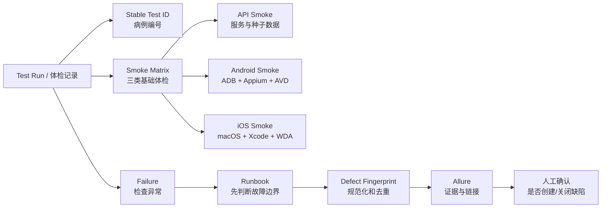
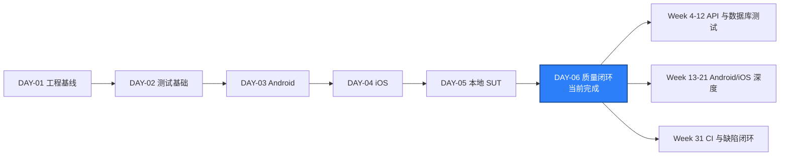

# DAY-06 - 质量闭环、缺陷指纹与三类 Smoke / Quality Closure, Defect Fingerprints, and Three Smoke Suites

- 日期 / Date: 2026-10-01
- 分支 / Branch: main
- 基线提交 / Base Commit: 4f5f297
- 当日提交 / Day Commit: f165884
- 远程仓库 / Remote: https://github.com/htb123-maker/quality-engineering-lab
- 完成状态 / Status: 通过 / PASSED

## 完成状态 / Completion Status

Day 6 已完成代码、文档、真实 SUT、真实 Android Session、Allure 和统一 smoke
矩阵验收。最终完整测试结果为 `15 passed, 1 skipped`，其中 iOS 因当前主机为
Windows 且缺少 macOS/Xcode/WDA 明确跳过，没有伪通过。

补充验收：GitHub macOS Runner Run `36829347849` 已真实通过 iOS smoke，
WDA 成功启动、Session 创建和退出均返回 HTTP 200。

English: Day 6 is complete. API and Android smoke passed against real local
services and devices, iOS was environment-skipped on Windows, and all source,
documentation, and report checks passed.

## 完成范围 / Scope

- 建立首份正式 ADR：本地 SUT 使用 Docker Compose、隔离端口、健康检查和
  volume。
- 建立正式失败质量门 runbook：边界检查、证据收集、失败分类、指纹搜索和
  退出条件。
- 建立缺陷生命周期、缺陷指纹和 Allure 链接规范。
- 实现 `qa_core.reporting.DefectFingerprint`，用规范化 JSON 和 SHA-256
  生成稳定缺陷指纹。
- 新增 API smoke：验证 SUT live、ready 和只读种子目录。
- 将共享 `sut_api_url` fixture 提升到 `tests/conftest.py`。
- 为 Android smoke 增加 ADB、设备状态和 Appium readiness 预检；环境不足时
  明确 skip。
- 为 API、Android 和 iOS smoke 增加稳定 `allure.testcase` ID 与 triage
  runbook 链接。
- 建立 `scripts/run_smoke_matrix.py`，统一运行三类 smoke 并输出
  `artifacts/smoke-matrix.json`。
- 把 API smoke 加入 Ubuntu SUT integration workflow。
- 使用真实 Docker SUT、Android 35 AVD 和 Appium 2.19.0 完成验收。
- 生成最新 Allure 报告。

English summary: added the first ADR, formal triage runbook, defect lifecycle
and fingerprint conventions, deterministic fingerprint code, API smoke,
environment-aware mobile smoke preconditions, a unified smoke matrix, CI
coverage, and real local acceptance evidence.

## 术语解释 / Glossary

| 名词 / Term | 简单解释 / Plain Meaning | 作用 / Purpose | 在本项目中的位置 / Position |
| --- | --- | --- | --- |
| ADR | Architecture Decision Record，架构决策记录 | 留下“为什么这样做”和历史约束 | `docs/adr/0001-local-sut-with-docker-compose.md` |
| Runbook | 故障发生时可照着执行的排障手册 | 降低定位和恢复时间 | `docs/runbooks/failed-quality-gate.md` |
| 质量门 / Quality Gate | 代码进入下一阶段前必须通过的检查 | 阻止已知失败被忽略 | Ruff、Mypy、pytest、Allure |
| Smoke Test | 最少量但覆盖关键启动路径的测试 | 快速确认系统主链路是否活着 | `tests/api`、`tests/android`、`tests/ios` |
| Traceability | 从测试结果追溯到 Test ID、Run、Commit 和缺陷的过程 | 让失败可解释、修复可验证 | Allure 标签、链接和日报 |
| Defect Fingerprint | 由失败事实规范化后生成的稳定摘要 | 辅助查找重复缺陷，不替代根因判断 | `DefectFingerprint` |
| SHA-256 | 把输入稳定转换成 256 位十六进制摘要的哈希算法 | 相同规范化输入产生相同摘要 | 缺陷指纹 `digest` |
| Canonical JSON | 字段顺序和分隔符固定后的 JSON | 保证相同内容得到相同哈希 | `canonical_payload` |
| Environment Skip | 当前环境根本不具备执行条件时的明确跳过 | 区分“未执行”和“执行通过” | Android 无设备、Windows iOS |
| Allure Test Case | Allure 中的稳定测试身份标签 | 让结果可以和测试用例、缺陷关联 | `@allure.testcase` |
| Failure Boundary | 失败究竟属于产品、测试、环境还是基础设施 | 防止把所有红色都当成产品 Bug | triage runbook |

简单理解：Day 6 不是再加一个功能，而是给已经跑起来的链路装上“病例编号、
检查流程和化验单”，让失败不容易被重复、漏记或误判。

## 通俗解读 / Plain-Language Guide

Day 6 像医院给检验科补三样东西：第一份科室规章（ADR），一份急诊分诊流程
（runbook），以及每份化验单唯一的编号规则（Test ID 和缺陷指纹）。API、
Android、iOS 三类 smoke 则是三个基础体检窗口，护士先判断设备是否具备检查
条件，再决定通过、失败或明确跳过。

**一句话理解：** 不是只让测试变绿，而是让每一次红色都有边界、编号、证据和
下一步。



说明：Agent 可以帮助分类、计算指纹和生成草稿，但正式创建、优先级调整和关闭
缺陷必须由人确认。

## 今日在整体路线中的位置 / Day Position



Day 6 位于基础设施后的收口位置：前面负责让 API、Android 和 iOS 能启动，
今天负责让结果能被执行、归类、追踪和验收。

## 质量检查 / Quality Checks

| 检查项 / Check | 结果 / Status | 证据 / Evidence |
| --- | --- | --- |
| Ruff | 通过 / PASS | `All checks passed!` |
| Mypy | 通过 / PASS | `Success: no issues found in 24 source files` |
| Unit tests | 通过 / PASS | `7 passed` |
| Smoke matrix | 通过 / PASS | API `1 passed`；Android `1 passed`；iOS `1 skipped` |
| 完整 pytest | 通过 / PASS | `15 passed, 1 skipped in 2.72s` |
| API smoke | 通过 / PASS | `tests/api/test_sut_smoke.py` |
| Android session smoke | 通过 / PASS | `Pixel_API_35_AOSP_ATD`、Appium `2.19.0` |
| iOS session smoke | 环境跳过 / ENV SKIP | Windows 无 macOS/Xcode/WDA |
| iOS macOS Runner smoke | 通过 / PASS | Run `36829347849`、`1 passed in 198.07s` |
| Compose SUT | 通过 / PASS | API、PostgreSQL、Redis 均为 `healthy` |
| Allure | 通过 / PASS | `artifacts/allure-report/index.html` |
| Smoke matrix JSON | 通过 / PASS | `artifacts/smoke-matrix.json` |
| ADR | 完成 / COMPLETE | `docs/adr/0001-local-sut-with-docker-compose.md` |
| Runbook | 完成 / COMPLETE | `docs/runbooks/failed-quality-gate.md` |
| Defect lifecycle | 完成 / COMPLETE | `docs/test-strategy/defect-lifecycle-and-allure.md` |
| Fingerprint unit tests | 通过 / PASS | `tests/unit/test_defect_fingerprint.py` |

## 验收方式 / Acceptance Method

### 前置条件 / Preconditions

1. Docker Desktop 正常运行，Linux engine 为 `running`。
2. 本地 SUT 已启动，API、PostgreSQL 和 Redis 为 `healthy`。
3. Android AVD `Pixel_API_35_AOSP_ATD` 已启动。
4. Appium Server `127.0.0.1:4723` 已启动且 `/status ready=true`。
5. 项目虚拟环境为 `.venv`，Python 为 3.12。
6. Windows 本机预期 iOS smoke 返回环境 skip。

### 静态与单元检查 / Static and Unit Checks

```powershell
.\.venv\Scripts\python.exe -m ruff check .

.\.venv\Scripts\python.exe -m mypy packages tests

uv run --no-sync pytest tests/unit -q
```

实际结果 / Actual results:

```text
All checks passed!
Success: no issues found in 24 source files
7 passed
```

### SUT 启动 / Start SUT

```powershell
docker desktop restart

.\scripts\start_sut.ps1
```

实际结果 / Actual results:

```text
Status running
PASS API live: HTTP 200
PASS API ready: status=ready
PASS Seeded catalog: atlas, LAB-001, LAB-002, LAB-003
PASS PostgreSQL: workspaces=2, users=3, items=4
PASS Redis: ping=True, dbsize=0
SUT ready: True
```

### Android 与 Appium / Android and Appium

```powershell
Start-Process `
  -FilePath 'D:\Android\Sdk\emulator\emulator.exe' `
  -ArgumentList @(
    '-avd',
    'Pixel_API_35_AOSP_ATD',
    '-no-window',
    '-no-audio',
    '-no-boot-anim',
    '-no-snapshot'
  ) `
  -WindowStyle Hidden

.\scripts\wait_for_android_ready.ps1 `
  -Serial emulator-5554 `
  -TimeoutSeconds 240

appium --address 127.0.0.1 --port 4723 --log-level debug
```

实际结果 / Actual results:

```json
{"serial":"emulator-5554","state":"device","boot_completed":"1","bootanim":"stopped","package_service":"Service package: found","settings_service":"Service settings: found"}
```

```text
Appium /status ready=true
Appium 2.19.0
```

### 三类 Smoke 矩阵 / Three-Suite Smoke Matrix

```powershell
uv run --no-sync python scripts\run_smoke_matrix.py
```

实际结果 / Actual results:

```text
[api] 1 passed
[android] 1 passed
[ios] 1 skipped
Smoke matrix summary: artifacts\smoke-matrix.json
```

### GitHub macOS Runner iOS Smoke / GitHub macOS Runner

远端 `main` 基线 / Remote `main` baseline:

```text
4f5f297
```

触发命令 / Trigger:

```powershell
gh workflow run ios-smoke.yml --ref main
gh run watch 36829347849 --exit-status
```

实际结果 / Actual results:

```text
iOS environment ready: True
WebDriverAgent 9.2.0 is ready to accept commands
POST /session 200 (184903 ms)
1 passed in 198.07s (0:03:18)
DELETE /session 200 (834 ms)
ios-simulator in 7m3s
```

说明：这次运行使用远端 `main` 的提交 `4f5f297`，因此验证的是 Day 4 已提交
iOS 基线，不包含本地尚未提交的 Day 5/Day 6 改动。

### 完整回归 / Full Regression

```powershell
uv run --no-sync pytest -q -p no:cacheprovider `
  --alluredir=artifacts/allure-results
```

实际结果 / Actual results:

```text
......s.........
15 passed, 1 skipped in 2.72s
```

### Allure / Allure Report

```powershell
$env:ALLURE_NO_ANALYTICS = "true"

allure generate artifacts/allure-results --clean `
  -o artifacts/allure-report
```

实际结果 / Actual results:

```text
Report successfully generated to artifacts\allure-report
```

## 证据路径 / Evidence

- ADR: `docs/adr/0001-local-sut-with-docker-compose.md`
- Runbook: `docs/runbooks/failed-quality-gate.md`
- 缺陷与 Allure 规范: `docs/test-strategy/defect-lifecycle-and-allure.md`
- API Smoke: `tests/api/test_sut_smoke.py`
- Android Smoke: `tests/android/test_session.py`
- iOS Smoke: `tests/ios/test_session.py`
- 缺陷指纹: `packages/qa_core/reporting/defect_fingerprint.py`
- 指纹单元测试: `tests/unit/test_defect_fingerprint.py`
- Smoke 矩阵入口: `scripts/run_smoke_matrix.py`
- Smoke 矩阵结果: `artifacts/smoke-matrix.json`
- Allure HTML: `artifacts/allure-report/index.html`
- Appium 日志: `artifacts/appium-server.out.log`
- AVD 日志: `artifacts/emulator.out.log`、`artifacts/emulator.err.log`
- CI 集成: `.github/workflows/sut-integration.yml`
- GitHub macOS Run: `https://github.com/htb123-maker/quality-engineering-lab/actions/runs/36829347849`
- iOS 诊断 artifact: `artifacts/github-run-36829347849/appium-ios.log`

## 变更文件 / Files Changed

- `docs/adr/0001-local-sut-with-docker-compose.md`
- `docs/runbooks/failed-quality-gate.md`
- `docs/runbooks/local-sut-compose.md`
- `docs/test-strategy/defect-lifecycle-and-allure.md`
- `packages/qa_core/reporting/__init__.py`
- `packages/qa_core/reporting/defect_fingerprint.py`
- `tests/api/__init__.py`
- `tests/api/test_sut_smoke.py`
- `tests/conftest.py`
- `tests/integration/test_sut.py`
- `tests/android/test_session.py`
- `tests/ios/test_session.py`
- `tests/unit/test_defect_fingerprint.py`
- `scripts/run_smoke_matrix.py`
- `pyproject.toml`
- `.github/workflows/sut-integration.yml`

说明：工作区中还包含 Day 5 已验收但尚未提交的改动的场景文件；本次没有回退、
覆盖或提交这些既有改动。

## 环境 / Environment

- Python: 3.12，项目 `.venv`
- Docker Desktop: 4.93.0，Linux engine `running`
- API: `http://127.0.0.1:18000`
- PostgreSQL: `127.0.0.1:15432`
- Redis: `127.0.0.1:16379`
- Appium: 2.19.0
- UiAutomator2 Driver: 4.2.9
- XCUITest Driver: 8.4.3
- Android AVD: `Pixel_API_35_AOSP_ATD` / Android 15
- Android 设备序列号: `emulator-5554`
- iOS 真实 Session: Day 4 GitHub Actions Run 36324371670 已通过

## 风险与限制 / Risks and Limitations

- 当前 Windows 主机不能本地运行 Xcode、iOS Simulator 和 WDA，因此 Day 6
  本地 iOS smoke 只能明确跳过；真实 iOS 证据由 GitHub macOS Runner
  Run `36829347849` 补充。
- GitHub macOS Run `36829347849` 使用的是基线提交 `4f5f297`，当时还未包含
  Day 5/Day 6 改动。该缺口已在 Day 7 由 Run `37130258592` 补齐：同一套 iOS
  smoke 针对包含 Day 5、Day 6 和 Day 7 全部改动的 `ff47a07` 真实通过。
- Docker Desktop 在本机 idle shutdown 后需要 `docker desktop restart` 才能
  恢复 Linux engine；该环境行为已记录，不属于应用缺陷。
- 在提升权限运行 pytest 时可能出现 `.pytest_cache` 权限警告；正式验收已用
  `-p no:cacheprovider` 避免该噪声。
- GitHub Actions workflow 当时尚未推送触发。Day 7 推送 `ff47a07` 后，
  Quality Gates、SUT Integration 和 iOS Appium Smoke 三个工作流都已在
  GitHub 上真实执行通过。
- 缺陷闭环目前只有生命周期、指纹和链接规范，尚未接入 GitLab/Jira 等具体
  Adapter；按计划在 Week 11 到 12 实现。
- Day 5 和 Day 6 的改动已在 Day 7 收尾时合并提交为 `f165884`；Day 5 的
  验收报告 `DAY-05.md` 随同该提交一起纳入版本历史。

## 下一步 / Next Day

1. 连续运行 smoke，检查 Appium session、Appium 进程、ADB 和端口是否泄漏。
2. 确认 Allure 报告中的三类 smoke 都有稳定 Test ID 和链接。
3. 记录本周最难的 3 个问题和最小复现。
4. 准备进入 Week 4：HTTP Client、超时、重试、日志和认证基础。
