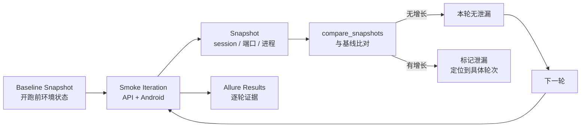
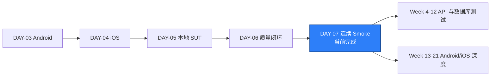

# DAY-07 - 连续 Smoke、泄漏检查与第一周收口 / Smoke Soak, Leak Checks, and Week 1 Closure

- 日期 / Date: 2026-10-03
- 分支 / Branch: main
- 基线提交 / Base Commit: f165884
- 当日提交 / Day Commit: 见本日提交 / see this day's commit
- 远程仓库 / Remote: https://github.com/htb123-maker/quality-engineering-lab
- 完成状态 / Status: 通过（含已记录限制）/ PASSED WITH RECORDED LIMITS

## 完成状态 / Completion Status

Day 7 完成了 Day 5 和 Day 6 的正式收口，并完成第一周的最后一项验收：连续运行
smoke、检查资源泄漏、生成第一份 Allure 报告。

连续 10 轮 API + Android smoke 全部通过，共 20 次用例执行；运行前后
Appium session、监听端口和进程数量完全一致，没有发现泄漏。

English: Day 7 closed out Day 5-06 (commit `f165884`), ran the API and Android
smoke suites ten consecutive times, and compared baseline and final
session/port/process snapshots. All 20 executions passed and no leak was
detected.

## 完成范围 / Scope

- 把 Day 5 和 Day 6 的 43 个文件合并提交为 `f165884`，Day 6 正式收口。
- 新增 `packages/qa_core/reporting/leak_report.py`：基线/最终快照比对，
  分别判定 session、端口和进程三类泄漏。
- 新增 `scripts/run_smoke_soak.py`：复用 `run_smoke_matrix.py`，连续执行
  N 轮 smoke，并在每轮后采集环境快照。
- 新增 `tests/unit/test_leak_report.py`：4 条单元测试覆盖稳定、泄漏、
  端口回归和 pytest 结果行解析。
- 连续运行 smoke 10 次，逐轮记录结果和泄漏状态，输出
  `artifacts/smoke-soak.json` 与 `artifacts/soak/matrix-01..10.json`。
- 生成第一份覆盖三类 smoke 的 Allure 报告，确认稳定 Test ID 和 triage
  链接都进入报告。
- 记录本周最难的 3 个问题和最小复现。

English summary: added deterministic leak comparison plus a soak runner that
reuses the existing smoke matrix, ran the API/Android smoke suites ten times
with no leak, generated the Allure report, and captured the week's three
hardest problems with minimal reproductions.

## 术语解释 / Glossary

| 名词 / Term | 简单解释 / Plain Meaning | 作用 / Purpose | 在本项目中的位置 / Position |
| --- | --- | --- | --- |
| Smoke Soak | 把同一组 smoke 连续跑很多次 | 暴露单次运行看不出的泄漏和 flaky | `scripts/run_smoke_soak.py` |
| 基线快照 / Baseline Snapshot | 第一轮开始前的环境状态 | 后续变化都以它为参照物 | `artifacts/smoke-soak.json` 的 `baseline` |
| Session Leak | Appium session 用完没有关闭 | 会占用设备和 Driver 资源，最终拖垮服务 | `/sessions` 返回值 |
| Port Leak | 测试结束后多出来的监听端口 | 通常是 Driver 或辅助进程没有退出 | `--watch-ports` 列表 |
| Process Leak | 测试结束后没有回收的进程 | 反复运行会累积内存和句柄 | `--process-patterns` 列表 |
| Flaky Test | 同样的代码，时有通过时有失败 | 破坏对测试结果的信任 | 本日 10 轮全部一致，未观察到 |
| Allure Retry | 同名用例的多次执行记录 | 让反复运行的结果可以逐轮对比 | `@allure.testcase` 分组 |

简单理解：Day 7 不是写新功能，而是把前面几天做好的 smoke 拿去“反复体检”，
看它跑完之后有没有留下垃圾。

## 通俗解读 / Plain-Language Guide

Day 7 像酒店客房验收：前六天教会了服务员怎么开房、打扫和登记（启动 SUT、
跑三类 smoke、给失败编号）。今天要一次性连续整理 10 间房，然后检查大堂里
有没有多出没归还的房卡（session）、还亮着的灯（端口）和没下班的员工（进程）。

**一句话理解：** 单次通过说明“能用”，连续 10 次通过且环境恢复原状，才说明
“可以交班”。



说明：每一轮都在同一份基线上比对，所以只要某一轮开始泄漏，就能直接定位到
是哪一轮引入的，而不是只知道“跑完 10 次之后有问题”。

## 今日在整体路线中的位置 / Day Position



Day 7 是第一周的出口。前面几天分别在搭环境、写 smoke、建规范；今天用连续运行
证明这套骨架不是“一次性的演示”，而是可以重复执行的基线。

### 第一周出口验收 / Week 1 Exit Checklist

| 出口条件 / Exit Condition | 结果 / Status | 证据 / Evidence |
| --- | --- | --- |
| SUT 可启动 | 通过 / PASS | API、PostgreSQL、Redis 三个容器 `healthy` |
| API smoke 可运行 | 通过 / PASS | 10 轮 `1 passed` |
| Android smoke 可运行 | 通过 / PASS | 10 轮 `1 passed`，Appium 2.19.0 + `emulator-5554` |
| iOS smoke 可运行 | 通过 / PASS | 本机环境跳过；GitHub macOS Runner Run `36829347849` |
| Allure 有报告 | 通过 / PASS | `artifacts/allure-report/index.html` |
| 无 session 泄漏 | 通过 / PASS | 基线 0 → 最终 0 |
| PyCharm 可调试 | 由人工确认 / MANUAL | `.venv` 内含 `pip`，可被 PyCharm 识别 |

## 质量检查 / Quality Checks

| 检查项 / Check | 结果 / Status | 证据 / Evidence |
| --- | --- | --- |
| Ruff | 通过 / PASS | `All checks passed!` |
| Mypy | 通过 / PASS（纯 Python 回退） | `Success: no issues found in 26 source files` |
| Unit tests | 通过 / PASS | `11 passed` |
| Smoke soak | 通过 / PASS | `10/10` 轮，共 20 次用例执行 |
| 泄漏检查 | 通过 / PASS | session、端口、进程均无增长 |
| 完整回归（不含集成） | 通过 / PASS | `15 passed, 1 skipped in 2.73s` |
| SUT 只读验证 | 通过 / PASS | catalog 3 条；PostgreSQL `2/3/4`；Redis `PONG` |
| Allure | 通过 / PASS | `artifacts/allure-report/index.html` |
| 集成测试 | 本机无法执行 / BLOCKED | `psycopg` 被 Smart App Control 拦截 |
| Day 5-6 收口提交 | 完成 / COMPLETE | `f165884` |

## 验收方式 / Acceptance Method

### 前置条件 / Preconditions

1. Docker Desktop 正常运行，Linux engine 为 `running`。
2. SUT 已启动，API、PostgreSQL 和 Redis 为 `healthy`。
3. Android AVD `Pixel_API_35_AOSP_ATD` 已启动，序列号为 `emulator-5554`。
4. Appium Server `127.0.0.1:4723` 已启动且 `/status ready=true`。
5. 项目虚拟环境为 `.venv`，Python 为 3.12。
6. Windows 本机预期 iOS smoke 返回环境 skip。

### 启动依赖 / Start Dependencies

```powershell
docker desktop start

.\scripts\start_sut.ps1

Start-Process `
  -FilePath 'D:\Android\Sdk\emulator\emulator.exe' `
  -ArgumentList @(
    '-avd', 'Pixel_API_35_AOSP_ATD',
    '-no-window', '-no-audio', '-no-boot-anim', '-no-snapshot', '-port', '5554'
  ) `
  -WindowStyle Hidden

.\scripts\wait_for_android_ready.ps1 -Serial emulator-5554 -TimeoutSeconds 300

Start-Process `
  -FilePath 'C:\Users\quan\AppData\Roaming\npm\appium.cmd' `
  -ArgumentList @('--address', '127.0.0.1', '--port', '4723', '--log-level', 'info') `
  -WindowStyle Hidden `
  -RedirectStandardOutput artifacts\appium-server.out.log `
  -RedirectStandardError artifacts\appium-server.err.log
```

实际结果 / Actual results:

```json
{"serial":"emulator-5554","state":"device","boot_completed":"1","bootanim":"stopped","package_service":"Service package: found","settings_service":"Service settings: found"}
```

```text
Appium /status ready=true (2.19.0)
```

### SUT 只读验证 / SUT Read-only Verification

`scripts/check_sut.py` 在模块层导入 `psycopg`，本机被 Smart App Control
拦截，因此用容器内客户端做等价验证。

```powershell
Invoke-WebRequest -Uri "http://127.0.0.1:18000/api/v1/workspaces/atlas/catalog" -UseBasicParsing

docker exec quality-engineering-lab-postgres-1 `
  psql -U qa -d qa -tAc "SELECT (SELECT COUNT(*) FROM workspaces), (SELECT COUNT(*) FROM users), (SELECT COUNT(*) FROM catalog_items);"

docker exec quality-engineering-lab-redis-1 redis-cli ping
```

实际结果 / Actual results:

```text
{"count": 3, "items": [LAB-001, LAB-002, LAB-003], "workspace": {"slug": "atlas"}}
2|3|4
PONG
```

`2|3|4` 与 `002_seed.sql` 的期望计数一致：2 个 workspace、3 个用户、
4 个 catalog item。

### 静态与单元检查 / Static and Unit Checks

```powershell
.\.venv\Scripts\python.exe -m ruff check .

.\.venv\Scripts\python.exe -m mypy packages tests

.\.venv\Scripts\python.exe -m pytest tests/unit -q -p no:cacheprovider
```

实际结果 / Actual results:

```text
All checks passed!
Success: no issues found in 26 source files
11 passed in 0.23s
```

说明：`mypy` 的检错能力来自纯 Python 源码副本，原因见“风险与限制”。

### 连续 Smoke 与泄漏检查 / Smoke Soak and Leak Checks

```powershell
.\.venv\Scripts\python.exe scripts\run_smoke_soak.py `
  --iterations 10 `
  --targets api android `
  --json-output artifacts\smoke-soak.json `
  --allure-results artifacts\allure-results
```

实际结果 / Actual results:

```text
[baseline] sessions=[]
[baseline] open_ports=[4723, 5554, 5555, 18000, 15432, 16379]
[baseline] processes={'appium': 3, 'emulator': 4, 'qemu-system': 1, 'adb': 1}

#1 exit=0 api=1 passed in 0.14s, android=1 passed in 2.38s leaked=False
#2 exit=0 api=1 passed in 0.20s, android=1 passed in 2.76s leaked=False
#3 exit=0 api=1 passed in 0.16s, android=1 passed in 2.32s leaked=False
#4 exit=0 api=1 passed in 0.15s, android=1 passed in 2.27s leaked=False
#5 exit=0 api=1 passed in 0.17s, android=1 passed in 2.67s leaked=False
#6 exit=0 api=1 passed in 0.17s, android=1 passed in 2.68s leaked=False
#7 exit=0 api=1 passed in 0.13s, android=1 passed in 2.76s leaked=False
#8 exit=0 api=1 passed in 0.20s, android=1 passed in 2.29s leaked=False
#9 exit=0 api=1 passed in 0.15s, android=1 passed in 2.40s leaked=False
#10 exit=0 api=1 passed in 0.16s, android=1 passed in 2.65s leaked=False

iterations: 10/10
all iterations passed: True
leaked: False
```

排除项 / Exclusions:

```json
{
  "leaked": false,
  "new_appium_sessions": [],
  "ports_opened": [],
  "ports_closed": [],
  "process_growth": {},
  "session_leak": false,
  "port_leak": false,
  "process_leak": false
}
```

10 轮总耗时约 44.7 秒，全部 20 次用例执行（10 API + 10 Android）通过，
没有任何一轮出现泄漏；Android 单轮耗时稳定在 2.27 到 2.76 秒之间，未见
随轮次增长的退化趋势。

### 完整回归与 Allure / Full Regression and Allure

```powershell
.\.venv\Scripts\python.exe -m pytest -q -p no:cacheprovider `
  --ignore=tests/integration --alluredir=artifacts/allure-results

$env:ALLURE_NO_ANALYTICS = "true"
allure generate artifacts/allure-results --clean -o artifacts/allure-report
```

实际结果 / Actual results:

```text
..s.............
15 passed, 1 skipped in 2.73s
Report successfully generated to artifacts\allure-report
```

报告内容核对 / Report verification:

```text
passed=15, skipped=1, failed=0, broken=0
SMOKE-API-SUT-001
SMOKE-ANDROID-SESSION-001
SMOKE-IOS-SESSION-001
```

三类 smoke 的稳定 Test ID 都进入了报告，失败用例可跳转到
`docs/runbooks/failed-quality-gate.md`。10 轮 soak 的结果按 `@allure.testcase`
分组成同一条用例的重试记录，所以报告首页显示 16 条唯一用例，而不是 36 条
原始执行记录。

## 本周最难的 3 个问题与最小复现 / Three Hardest Problems of Week 1

### 1. macOS Runner 首次 WDA 编译超时（Day 4）

- 现象：干净 Runner 上创建 iOS session 失败，WDA 启动超过默认 60 秒预算。
- 最小复现：在未缓存的 macOS Runner 上执行 iOS smoke，观察
  `WebDriverAgent` 启动耗时超过 60 秒。
- 定位边界：问题在 `Appium Server -> XCUITest Driver -> WDA -> Simulator`
  这段启动链路，不在 pytest 断言。
- 处理：把启动预算提高到 240 秒并增加启动重试，真实 session 在 161 秒内
  建立，`POST /session 200`、`DELETE /session 200` 均正常。

### 2. Docker Desktop Linux engine 空闲后关闭（Day 5）

- 现象：空闲一段时间后，所有容器操作和 SUT fixture 一起失败。
- 最小复现：Docker Desktop 空闲后执行
  `docker info`，返回
  `open //./pipe/dockerDesktopLinuxEngine: The system cannot find the file specified`。
- 定位边界：属于本机环境行为，不是 Compose 配置或应用缺陷。
- 处理：执行 `docker desktop start`，再用 `.\scripts\start_sut.ps1` 恢复，
  三个容器恢复 `healthy`。

### 3. Smart App Control 拦截 Python 二进制扩展（Day 7）

- 现象：`mypy` 和 `psycopg` 无法导入，重装依赖后依旧失败。
- 最小复现：`.\.venv\Scripts\python.exe -c "import mypy"`，返回
  `ImportError: DLL load failed while importing mypy: 应用程序控制策略已阻止此文件。`
- 定位边界：`python -c "import pydantic_core"` 正常，说明不是 Python 环境
  或包损坏；`VerifiedAndReputablePolicyState=1` 表明 Smart App Control
  处于强制模式，本机策略按文件信誉拦截了这两个未受信任的 `.pyd`。
- 处理：不擅自修改系统安全策略。类型检查改用不含 `.pyd` 的纯 Python
  mypy 副本完成；依赖 `psycopg` 的集成测试本机不执行，改由容器内 `psql`
  和 Ubuntu SUT integration workflow 覆盖。

## 证据路径 / Evidence

- 泄漏比对逻辑: `packages/qa_core/reporting/leak_report.py`
- 泄漏比对单测: `tests/unit/test_leak_report.py`
- Soak 入口: `scripts/run_smoke_soak.py`
- Soak 汇总: `artifacts/smoke-soak.json`
- 单轮矩阵结果: `artifacts/soak/matrix-01.json` 到 `matrix-10.json`
- Allure HTML: `artifacts/allure-report/index.html`
- Allure 原始结果: `artifacts/allure-results`
- Appium 日志: `artifacts/appium-server.out.log`
- AVD 日志: `artifacts/emulator.out.log`、`artifacts/emulator.err.log`
- Day 5-6 收口提交: `f165884`
- iOS macOS Runner: `https://github.com/htb123-maker/quality-engineering-lab/actions/runs/36829347849`

## 变更文件 / Files Changed

- `packages/qa_core/reporting/leak_report.py`
- `packages/qa_core/reporting/__init__.py`
- `tests/unit/test_leak_report.py`
- `scripts/run_smoke_soak.py`
- `reports/daily/DAY-06.md`（补充收口提交号）
- `reports/daily/DAY-07.md`

## 环境 / Environment

- Python: 3.12.14，项目 `.venv`
- Docker Desktop: server 29.8.1，Linux engine `running`
- API: `http://127.0.0.1:18000`
- PostgreSQL: `127.0.0.1:15432`
- Redis: `127.0.0.1:16379`
- Appium: 2.19.0
- UiAutomator2 Driver: 4.2.9
- Android AVD: `Pixel_API_35_AOSP_ATD` / Android 15 / `emulator-5554`
- 监听端口基线: `4723`、`5554`、`5555`、`18000`、`15432`、`16379`

## 风险与限制 / Risks and Limitations

- Smart App Control 处于强制模式，会拦截未受信任的 Python 二进制扩展。
  `mypy` 已用纯 Python 副本替代验证；`psycopg` 没有可用的纯 Python libpq，
  因此 `tests/integration/test_sut.py` 在本机无法执行。该文件仍需在
  Ubuntu SUT integration workflow 或关闭策略后的本机验证。
- 上述策略是系统级安全设置，本次没有修改。是否关闭必须由项目所有者决定，
  Smart App Control 关闭后不能在不重装系统的前提下重新开启。
- 本日 soak 只覆盖 `api` 和 `android`；Windows 主机不能运行 Xcode/WDA，
  iOS 的真实证据仍来自 GitHub macOS Runner。
- `--watch-ports` 只检查固定端口列表，不代表对全部动态端口的完整审计。
- 进程检查依赖命令行子串匹配，对同名但无关的进程可能产生噪声；本次基线与
  最终计数一致，未触发该风险。
- 引入提权后运行 pytest 时可能出现 `.pytest_cache` 权限提示，正式验收已用
  `-p no:cacheprovider` 避免。
- 本日未执行 `psql` 的写操作，也未修改 `001_schema.sql` 或 `002_seed.sql`，
  PostgreSQL 数据保持卷内既有状态。

## 下一步 / Next Day

1. 进入 Week 4：HTTP Client 封装、超时、重试、日志和认证基础。
2. 让 `scripts/check_sut.py` 在无法导入 `psycopg` 时给出明确的环境提示，
   而不是直接崩溃。
3. 视需要把 soak 的端口和进程审计扩展到动态端口范围。
4. 在 macOS CI 或关闭 Smart App Control 后补齐集成测试的本机证据。
