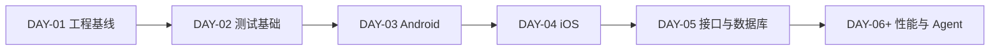

# DAY-XX - 中文标题 / English Title

- 日期 / Date:
- 分支 / Branch:
- 基线提交 / Base Commit:
- 当日提交 / Day Commit:
- Pull Request:

## 完成范围 / Scope

用中文说明当天完成了什么，以及这些工作为什么满足目标要求。

English summary: describe what was completed and how it satisfies the day goal.

## 术语解释 / Glossary

用简单语言解释当天出现的专业名词。每一行必须说明：

| 名词 / Term | 简单解释 / Plain Meaning | 作用 / Purpose | 在本项目中的位置 / Position |
| --- | --- | --- | --- |
|  |  |  |  |

## 今日在整体路线中的位置 / Day Position

说明当前 Day 已完成哪些前置条件，以及它为后续哪些能力提供基础。

## 质量检查 / Quality Checks

| 检查项 / Check | 结果 / Status | 证据 / Evidence |
| --- | --- | --- |
| Ruff | 通过 / PASS | |
| Mypy | 通过 / PASS | |
| Pytest | 通过 / PASS | |
| Allure | 通过 / PASS | |

说明：`PASS`、`FAILED`、命令输出和错误信息保留原始英文，避免改变工具语义。

## 验收方式 / Acceptance Method

这里必须写出可复制执行的中文验收步骤。每一段包含：

1. 前置条件 / Precondition。
2. 执行命令 / Commands。
3. 预期结果 / Expected Results。
4. 证据路径 / Evidence Paths。
5. 未验证项 / Unverified Items。

## 变更文件 / Files Changed

列出重要的源码、配置、测试和文档变更。

## 环境 / Environment

记录 Python、依赖、设备、服务、端口、JDK、Node.js 或基础设施前置条件。

## 风险与限制 / Risks and Limitations

如实记录未解决问题、网络限制、环境限制和尚未执行的验证。

## 下一步 / Next Day

列出下一日的最小可执行任务和验收目标。
