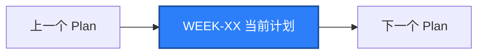

# WEEK-XX - 中文计划标题 / English Plan Title

- 计划 / Plan:
- 日期范围 / Date Range:
- 分支 / Branch:
- 基线提交 / Base Commit:
- 计划提交 / Plan Commit:
- Pull Request:

## 计划目标 / Plan Goal

说明本计划对应课表中的哪一周、要交付什么能力，以及验收边界。

English summary: state the planned capability and its acceptance boundary.

## 完成状态 / Completion Status

明确写 `通过 / PASS`、`部分通过 / PARTIAL` 或 `失败 / FAILED`，并说明本机、
Linux 容器、macOS Runner 或设备云分别实际执行了什么。

## 完成范围 / Scope

- 完成的源码、配置、测试、脚本和文档。
- 本计划解决的问题。
- 明确没有包含在下周或后续计划中的内容。

## 术语解释 / Glossary

| 名词 / Term | 简单解释 / Plain Meaning | 作用 / Purpose | 在本项目中的位置 / Position |
| --- | --- | --- | --- |
|  |  |  |  |

## 通俗解读 / Plain-Language Guide

先用一句生活化的话说明这个 Plan 在做什么，再用一张图展示真实调用链。

**一句话理解：** 本计划可以类比成生活中的什么。


说明：图只解释主线，不替代验收命令和技术细节。

## 计划在整体路线中的位置 / Plan Position



说明本计划依赖哪些前置条件，以及为后续哪些能力提供基础。

## 质量检查 / Quality Checks

| 检查项 / Check | 结果 / Status | 执行环境 / Environment | 证据 / Evidence |
| --- | --- | --- | --- |
| Ruff |  | Windows |  |
| Mypy |  | Windows |  |
| Unit tests |  | Windows |  |
| Local regression |  | Windows |  |
| Integration tests |  | Linux container |  |
| iOS smoke |  | macOS Runner |  |

说明：`PASS`、`FAILED`、命令输出和错误信息保留原始英文，避免改变工具语义。

## 验收方式 / Acceptance Method

### 前置条件 / Preconditions

列出运行命令前必须存在的服务、设备、账号和授权。

### 执行命令 / Commands

写出可复制执行的完整命令，并标明执行环境。

```powershell

```

### 预期结果 / Expected Results

```text

```

### 证据路径 / Evidence

- Allure:
- JSON:
- 日志:
- GitHub Run:

### 未验证项 / Unverified Items

明确列出未执行、被阻塞或只能由其他平台验证的内容。

## 变更文件 / Files Changed

列出本计划的重要源码、配置、测试、脚本和文档。

## 环境 / Environment

记录 Python、依赖、设备、服务、端口、JDK、Node.js、容器和远端 Runner 状态。

## 风险与限制 / Risks and Limitations

如实记录平台边界、网络限制、系统安全策略、未提交状态和后续需要补齐的验证。

## 下一步 / Next Plan

列出下一个 Plan 的目标、最小可执行任务和验收标准。
