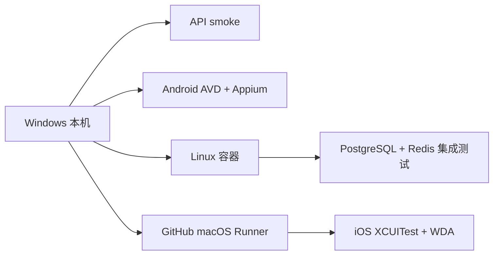
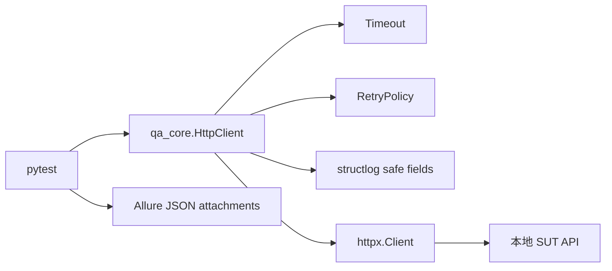
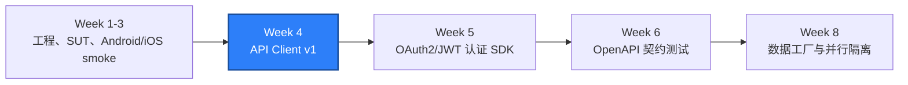

# WEEK-04 - 共享 HTTP Client v1 / Shared HTTP Client v1

- 计划 / Plan: Week 4，httpx、配置、超时、重试、日志和 Allure
- 日期范围 / Date Range: 2026-10-05
- 分支 / Branch: main
- 基线提交 / Base Commit: 16860b1
- 计划提交 / Plan Commit: pending（当前工作区尚未提交）
- Pull Request: pending

## 计划目标 / Plan Goal

Week 4 的目标是把测试中零散的 `httpx` 调用升级为共享的 API Client v1，
统一处理基础 URL、连接和读写超时、有限重试、结构化日志、测试报告证据和
环境配置。后续 API、Android/iOS E2E 建数、数据库准备和 Locust 都应复用这层
能力，而不是分别发明请求规则。

English: deliver a shared synchronous HTTP client with typed settings, bounded
retries, safe structured logs, and selected Allure evidence for API tests.

## 完成状态 / Completion Status

通过 / PASS。

本计划不只在本机单元测试中通过，也完成了三条真实执行证据：

- Windows 本机：API、Android 和其余非平台专属测试 `22 passed`。
- Linux 容器：真实 PostgreSQL 和 Redis 集成测试 `4 passed`。
- macOS Runner：真实 XCUITest/WDA iOS smoke `1 passed`。

Windows 本机仍会对 `tests/ios` 显示 skip，这是 Xcode/WDA 的平台边界。远端
`main` 基线 `16860b1` 已在 GitHub macOS Runner 上真实执行通过；当前 Week 4
改动仍在未提交工作区，且没有修改 iOS Driver 和 iOS smoke 文件，因此这次 run
证明的是 macOS 执行链路，不是未提交工作树的逐提交验证。不能把 Windows 的
skip 当作 iOS 通过，也不再把“没有执行”误写成“环境失败”。

### 2026-10-08 复核 / Recheck

进入 Week 5 前重新执行了 Week 4 的静态检查和核心单元测试：

```powershell
.\.venv\Scripts\python.exe -m ruff check .
.\.venv\Scripts\python.exe -m pytest `
  tests\unit\test_http_client.py `
  tests\unit\test_settings.py `
  -q -p no:cacheprovider
```

实际结果：

```text
All checks passed!
9 passed in 0.05s
```

结论：Week 4 的 HTTP Client、配置、超时和重试核心没有回归。复核发生在 Week 5
改动同时存在的工作区，因此它证明的是当前组合工作树仍通过，不替代 Week 4
独立提交上的远端验收。未提交和“iOS Run 对应旧基线”两项限制仍然有效。

## 完成范围 / Scope

- 新增 `qa_core.http.HttpClient` 和 `RetryPolicy`。
- 增加 API 连接、读取、写入和连接池四类超时配置。
- 增加幂等方法有限重试、指数退避、抖动和 `Retry-After` 支持。
- POST/PATCH 默认不重试，只有调用方显式确认幂等时才允许 `retry=True`。
- 增加结构化请求日志，只记录方法、请求路径、尝试次数、耗时和状态，
  不记录查询字符串、请求头或请求体。
- API smoke 改用共享 Client，并把 Live、Ready、Catalog 响应附加到 Allure。
- 新增 ADR，固定 HTTP 超时、重试和日志边界。
- 修复 Android 本地执行环境：AVD、ADB 和 Appium 真实启动，不再因沙箱权限
  跳过 Android smoke。
- 恢复 GitHub CLI 登录，并用 macOS Runner 真实执行 iOS smoke。
- 新增 Linux 容器集成测试脚本，绕开 Windows Smart App Control 对
  `psycopg` 二进制扩展的拦截，同时不关闭系统安全策略。

不在本计划内：

- OAuth2/OIDC、JWT 和并发 Refresh Token，属于 Week 5。
- Pydantic 响应模型、OpenAPI 和 JSON Schema 契约测试，属于 Week 6。
- 数据工厂、并行数据隔离和 120 条 API 测试，属于 Week 8。

## 术语解释 / Glossary

| 名词 / Term | 简单解释 / Plain Meaning | 作用 / Purpose | 在本项目中的位置 / Position |
| --- | --- | --- | --- |
| HTTP Client | 统一发送 HTTP 请求的工具层 | 避免每条测试自己设置请求规则 | `packages/qa_core/http/client.py` |
| Timeout | 对连接、读取、写入和等待连接池的最长等待时间 | 防止测试无限挂起 | `Settings.api_*_timeout_seconds` |
| Retry | 请求失败后的再次尝试 | 处理短暂网络和 5xx 故障 | `RetryPolicy` |
| Idempotent | 重复执行不会产生额外业务副作用 | 判断请求能否安全重试 | GET、HEAD、PUT、DELETE 等 |
| Exponential Backoff | 每次失败后等待时间成倍增长 | 降低持续冲击服务端的概率 | `delay_seconds()` |
| Jitter | 在退避时间上加入小幅随机变化 | 避免多个 worker 同时重试 | `jitter_ratio` |
| Retry-After | 服务端告诉客户端多久后再试 | 尊重 429/503 的服务端节奏 | 响应头解析 |
| Structured Log | 字段稳定的机器可读日志 | 后续用于失败分诊和 Trace 关联 | `structlog` |
| Allure Attachment | 附加到测试结果的文件或 JSON | 保存真实响应证据 | `tests/api/test_sut_smoke.py` |
| AVD | Android Virtual Device，Android 虚拟设备 | 本地执行 UiAutomator2 smoke | `Pixel_API_35_AOSP_ATD` |
| XCUITest | Apple 的 iOS UI 自动化测试技术 | 在 macOS 上驱动 iOS Simulator | GitHub `ios-smoke.yml` |
| WDA | WebDriverAgent，XCUITest Driver 的代理 | 接收 Appium 命令并操作 iOS | macOS Runner |
| Smart App Control | Windows 的应用控制安全策略 | 阻止未受信任二进制扩展加载 | 本机 `psycopg`/`mypy` 限制 |
| Linux Container | 与 Windows 隔离的 Linux 执行环境 | 运行依赖 Linux 二进制扩展的测试 | `scripts/run_integration_linux.ps1` |

## 通俗解读 / Plain-Language Guide

把 Week 4 想成给测试团队建一个统一收发室：所有请求都从这里出入，收发室会给
每件请求设定等待上限、记录路径和耗时，遇到临时故障按规则重投；POST 这种可能
产生新业务的“包裹”默认只送一次。测试报告则保留经过选择的回执，而不是把所有
请求头和认证信息都抄进日志。

同时，这个计划把三种执行环境明确分开：



真实调用链：



**一句话理解：** 本计划把“每个测试自己发请求”改造成“所有测试共用一套有门禁、
有重试规则、有记录方式的收发室”。

## 计划在整体路线中的位置 / Plan Position



Week 4 是接口自动化的共享入口。后面的认证、契约、数据库造数、E2E 和性能测试
都应该复用这层 Client，而不是重新创建一套请求逻辑。

## 质量检查 / Quality Checks

| 检查项 / Check | 结果 / Status | 执行环境 / Environment | 证据 / Evidence |
| --- | --- | --- | --- |
| Ruff | 通过 / PASS | Windows | `All checks passed!` |
| Mypy | 通过 / PASS | Windows | `Success: no issues found in 29 source files` |
| Unit tests | 通过 / PASS | Windows | `18 passed` |
| 本机 API + Android 回归 | 通过 / PASS | Windows | `22 passed` |
| Android smoke | 通过 / PASS | Windows + AVD + Appium | `1 passed in 5.31s` |
| API smoke | 通过 / PASS | Windows + Compose SUT | `1 passed in 0.14s` |
| PostgreSQL/Redis 集成测试 | 通过 / PASS | Linux container | `4 passed in 0.57s` |
| iOS smoke | 通过 / PASS | GitHub macOS Runner | `1 passed in 216.31s` |
| iOS workflow job | 通过 / PASS | GitHub Actions | Run `37327396190`，`8m36s` |
| Allure | 通过 / PASS | Windows | `artifacts/allure-report-week4-final/index.html` |

## 验收方式 / Acceptance Method

### 前置条件 / Preconditions

1. 使用项目 `.venv`，Python 3.12。
2. Docker Desktop Linux engine 正常运行，Compose SUT 为 healthy。
3. Android AVD `Pixel_API_35_AOSP_ATD` 处于 `device`，Appium 2.19.0 ready。
4. GitHub CLI 已登录，token 包含 `repo` 和 `workflow` 权限。
5. Windows 本机不执行 XCUITest，统一交给 macOS Runner。

### 静态与单元检查 / Static and Unit Checks

```powershell
.\.venv\Scripts\python.exe -m ruff check .
.\.venv\Scripts\python.exe -m mypy packages tests
.\.venv\Scripts\python.exe -m pytest tests/unit -q -p no:cacheprovider
```

预期结果：

```text
All checks passed!
Success: no issues found in 29 source files
18 passed
```

### 本机 API 与 Android / Local API and Android

```powershell
.\.venv\Scripts\python.exe -m pytest -q -p no:cacheprovider `
  --ignore=tests/integration --ignore=tests/ios
```

预期结果：

```text
22 passed
```

本命令在普通用户权限下执行。Codex 沙箱曾因受限令牌禁止 ADB 写入 `.android`，
该问题通过真实用户权限启动 AVD/Appium 解决，不是代码或 ACL 缺口。

### Linux 集成测试 / Linux Integration Tests

```powershell
.\scripts\run_integration_linux.ps1
```

预期结果：

```text
4 passed
```

脚本从 `uv.lock` 导出依赖，在 `quality-engineering-lab_default` 网络内连接
真实 API、PostgreSQL 和 Redis。它不修改 Windows Smart App Control。

### macOS iOS Smoke / macOS iOS Smoke

```powershell
gh auth status
gh workflow run ios-smoke.yml --ref main
gh run list --workflow ios-smoke.yml --limit 1
gh run watch <run-id> --exit-status
```

本次实际 run：

```text
https://github.com/htb123-maker/quality-engineering-lab/actions/runs/37327396190
remote main base commit: 16860b1
iOS environment ready: True
1 passed in 216.31s
ios-simulator in 8m36s
```

### 证据路径 / Evidence

- HTTP Client: `packages/qa_core/http/client.py`
- 配置: `packages/qa_core/config/settings.py`
- 单元测试: `tests/unit/test_http_client.py`
- API smoke: `tests/api/test_sut_smoke.py`
- ADR: `docs/adr/0002-http-client-timeout-and-retry.md`
- Linux 集成脚本: `scripts/run_integration_linux.ps1`
- iOS runbook: `docs/runbooks/ios-xcuitest-simulator.md`
- Linux SUT runbook: `docs/runbooks/local-sut-compose.md`
- Allure: `artifacts/allure-report-week4-final/index.html`
- Linux Allure: `artifacts/docker-integration/`
- Android Appium 日志: `artifacts/appium-server.out.log`
- Android Emulator 日志: `artifacts/emulator.out.log`
- iOS macOS Runner:
  `https://github.com/htb123-maker/quality-engineering-lab/actions/runs/37327396190`

### 未验证项 / Unverified Items

- Windows 本机不能执行 XCUITest；本机 `tests/ios` 仍会显示 skip。
- iOS Run `37327396190` 对应远端基线 `16860b1`，不是当前未提交 Week 4 工作树；
  形成计划提交后必须再触发一次远端 iOS smoke。
- 本机 `.venv` 仍受 Smart App Control 影响，不能直接加载 `psycopg` 二进制扩展；
  集成测试通过 Linux 脚本执行。
- 当前改动尚未提交、推送和创建 Pull Request。
- 本计划没有覆盖真实 iOS 真机、设备云或签名链路。

## 计划复盘 / Plan Retrospective

### 最难的 3 个问题

1. 非幂等请求重试边界
   - 风险：POST 在超时后重试可能重复创建资源。
   - 处理：默认只重试幂等方法，POST/PATCH 必须显式开启。
   - 证据：`tests/unit/test_http_client.py`。

2. Windows 与 iOS 的平台边界
   - 现象：Windows 本机只能 skip iOS smoke。
   - 处理：恢复 GitHub CLI 登录，使用 macOS Runner 作为真实执行环境。
   - 证据：Run `37327396190`。

3. Windows Smart App Control 与 psycopg
   - 现象：本机加载 `psycopg` 二进制扩展被系统策略阻止。
   - 处理：不降低系统安全策略，使用锁定依赖的 Linux 容器执行。
   - 证据：`scripts/run_integration_linux.ps1`，`4 passed`。

### 本计划留下的可复用能力

- 统一请求超时、重试和日志规则。
- 可在 API、移动端 E2E 和后续性能任务中复用的 Client 接口。
- Windows、Linux 和 macOS 三类执行环境的明确分工。
- Allure 报告和跨平台 CI 证据链。

## 变更文件 / Files Changed

- `.env.example`
- `docs/adr/0002-http-client-timeout-and-retry.md`
- `docs/runbooks/ios-xcuitest-simulator.md`
- `docs/runbooks/local-sut-compose.md`
- `docs/PLAN.md`
- `packages/qa_core/config/settings.py`
- `packages/qa_core/http/__init__.py`
- `packages/qa_core/http/client.py`
- `scripts/run_integration_linux.ps1`
- `tests/api/test_sut_smoke.py`
- `tests/unit/test_http_client.py`
- `tests/unit/test_settings.py`
- `reports/weekly/TEMPLATE.md`
- `reports/weekly/WEEK-04.md`

## 环境 / Environment

- Python: 3.12，项目 `.venv`
- Docker Desktop: Linux engine running
- SUT API: `http://127.0.0.1:18000`
- PostgreSQL: `127.0.0.1:15432`
- Redis: `127.0.0.1:16379`
- Appium: 2.19.0，`http://127.0.0.1:4723`
- Android AVD: `Pixel_API_35_AOSP_ATD`
- Android serial: `emulator-5554`
- UiAutomator2 Driver: 4.2.9
- GitHub Actions macOS Runner: run `37327396190`
- GitHub CLI: authenticated as `htb123-maker`

## 风险与限制 / Risks and Limitations

- Windows 本机 iOS skip 仍会出现在本地 pytest 输出中，这是预期平台边界；
  计划报告和最终结论必须引用 macOS Runner，而不是把 skip 标为通过。
- Linux 集成脚本每次使用一次性容器安装锁定依赖，首次执行需要网络和 Docker，
  耗时会高于本机单元测试。
- 当前 Client 是同步实现。后续 Locust 高并发场景需要重新评估连接池、异步模型
  和每进程资源预算。
- 重试只覆盖有限瞬时错误；如果重试掩盖了持续 5xx、配额或产品缺陷，仍必须进入
  失败分诊。
- 当前所有 Week 4 改动仍在工作区，尚未形成计划提交。

## 下一步 / Next Plan

进入 Week 5 认证 SDK：

1. 实现 OAuth2/OIDC 登录和 token 解析。
2. 支持 JWT 过期判断、Cookie 和 Refresh Token。
3. 使用锁或单飞机制处理并发刷新。
4. 增加 token 过期、刷新失败、权限不足和重复刷新测试。
5. 延续共享 HTTP Client，不复制请求、超时、重试和日志逻辑。

Week 5 的验收标准是认证状态可重复、并发刷新无竞态、失败边界可诊断，并且
认证 SDK 能被后续 API、移动端 E2E 和性能测试复用。
