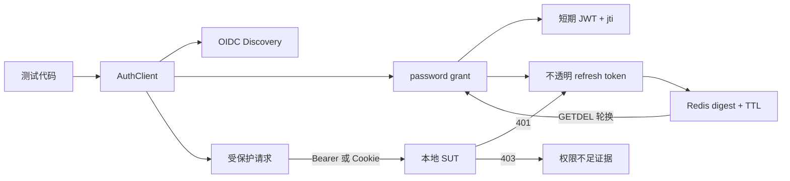
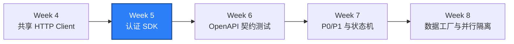

# WEEK-05 - OAuth2/OIDC 与并发刷新认证 SDK / OAuth2/OIDC and Concurrent Refresh SDK

- 计划 / Plan: Week 5，OAuth2/OIDC、JWT、Cookie 和并发刷新
- 日期范围 / Date Range: 2026-10-08
- 分支 / Branch: main
- 基线提交 / Base Commit: 16860b1
- 计划提交 / Plan Commit: pending（Week 4 与 Week 5 改动仍在工作区）
- Pull Request: pending

## 计划目标 / Plan Goal

Week 5 的目标是把 Week 4 的共享 HTTP Client 扩展为认证 SDK，统一处理登录、
JWT 到期、Bearer/Cookie 传递、Refresh Token 轮换、并发刷新、注销和错误边界。
后续 API、Android/iOS E2E 建数、数据库准备和 Locust 应复用这套认证状态，而
不是分别编写 token 逻辑。

English summary: deliver a reusable authentication SDK with OIDC discovery,
short-lived JWT access tokens, rotating refresh tokens, thread-safe single-flight
refresh, cookie transport, revocation, and diagnosable failure boundaries.

## 完成状态 / Completion Status

通过 / PASS（Windows 本机 + Linux 容器）。

本计划完成了：

- Windows 本机：Ruff、Mypy、25 条单元测试和 6 条真实 API 测试通过。
- Linux 容器：4 条数据库/SUT 集成测试和 6 条 API 认证契约合计 `10 passed`。
- 本地 Compose SUT 已重建，OIDC discovery、登录、Bearer、Cookie、403、刷新
  轮换和重放拒绝均已真实执行。

本计划没有使用 macOS Runner，因为 Week 5 只改共享认证层和本地 SUT API，没有
修改 Android/iOS Driver。Windows 本机和 Linux 容器足以验证本计划的范围。

## 完成范围 / Scope

- 新增 `qa_core.auth.AuthClient`、`TokenSet`、`OidcMetadata` 和认证异常。
- 支持 OIDC discovery、password grant、refresh token grant 和注销。
- 支持 Bearer 与 HttpOnly Cookie 两种访问凭证传递模式。
- 支持 JWT claims 非可信解码，用于到期和诊断，不作为授权事实。
- 实现到期安全窗口、401 后单次恢复和线程安全单飞刷新。
- 刷新失败时清理本地会话并返回结构化 OAuth 错误。
- 本地 SUT 新增 discovery 和认证路由。
- Refresh token 使用 Redis SHA-256 摘要、TTL 和原子 `GETDEL` 轮换。
- Access token 使用 HS256 JWT，并通过 `jti` 保证每次签发唯一。
- 增加 owner/admin 与 viewer 的 403 权限边界。
- 新增 ADR、runbook、单元测试、真实 API 测试和 Linux 验收。

不在本计划内：

- Pydantic 响应模型、OpenAPI 和 JSON Schema 契约测试，属于 Week 6。
- 数据工厂、并行数据隔离和 120 条 API 测试，属于 Week 8。
- 外部 IdP、Keycloak、JWKS、RS256、Authorization Code + PKCE 和 MFA。
- Appium 端登录 Flow，属于 Android/iOS 与 E2E 阶段。
- Locust 高并发 token 池和异步认证。

## 术语解释 / Glossary

| 名词 / Term | 简单解释 / Plain Meaning | 作用 / Purpose | 在本项目中的位置 / Position |
| --- | --- | --- | --- |
| OIDC Discovery | 客户端先读取认证服务公开配置 | 避免把端点硬编码到多个测试 | `/.well-known/openid-configuration` |
| OAuth2 Grant | 获取 token 的授权方式 | 本计划覆盖 password 和 refresh token | `/oauth/token` |
| JWT | 带签名、可验证的老三段 token | 保存用户、角色和过期时间 | `_issue_access_token` |
| `jti` | JWT 的唯一标识 | 保证每次刷新后的 access token 不同 | JWT claims |
| Refresh Token | 用来换取新 token 的长期凭证 | 不要求用户反复登录 | Redis `auth:refresh:*` |
| Rotation | 每次刷新后旧 token 立即失效 | 防止重放和长期泄露 | Redis atomic `GETDEL` |
| Single Flight | 多个请求共享一次刷新操作 | 防止并发重复消费 refresh token | `AuthClient._refresh_lock` |
| Bearer | 在 Authorization 头传 access token | 适合 API 和测试客户端 | `AuthClient(mode="bearer")` |
| Cookie | 浏览器自动携带的会话凭证 | 覆盖 WebView 和 Cookie 边界 | `qa_access_token` |
| `HttpOnly` | JavaScript 不能直接读取 Cookie | 降低令牌被页面脚本读取的风险 | `Set-Cookie` |
| 403 | 已认证但权限不足 | 区分 token 无效和角色不足 | `/api/v1/admin/audit` |
| Allure Attachment | 附加结构化测试证据 | 保留 discovery、用户和错误响应 | `tests/api/test_auth.py` |

## 通俗解读 / Plain-Language Guide

把认证 SDK 想成公司的门禁前台：员工先出示工牌换取短期通行证；通行证快过期
时，前台自动用长期续期凭证换一张新通行证。很多部门同时来换证时，只允许一个
人进前台，其他人等结果，避免同一张续期凭证被重复使用。



**一句话理解：** 本计划把散落在测试里的“登录、续期、带凭证”收进一个前台，
并规定同一时间只处理一次续期。

## 计划在整体路线中的位置 / Plan Position



Week 5 让共享 HTTP Client 拥有可复用身份。Week 6 之后的契约、数据库、E2E 和
性能测试都应通过 AuthClient 获取认证状态。

## 质量检查 / Quality Checks

| 检查项 / Check | 结果 / Status | 执行环境 / Environment | 证据 / Evidence |
| --- | --- | --- | --- |
| Ruff | 通过 / PASS | Windows | `All checks passed!` |
| Mypy | 通过 / PASS | Windows | `Success: no issues found in 33 source files` |
| Unit tests | 通过 / PASS | Windows | `25 passed` |
| API smoke + auth | 通过 / PASS | Windows + Compose SUT | `6 passed` |
| Linux integration + auth | 通过 / PASS | Linux container | `10 passed` |
| SUT rebuild/readiness | 通过 / PASS | Docker Compose | API、PostgreSQL、Redis healthy |
| Allure attachments | 通过 / PASS | Windows API tests | `artifacts/allure-report-week5/index.html` |

## 验收方式 / Acceptance Method

### 前置条件 / Preconditions

1. 使用项目 `.venv`，Python 3.12。
2. Docker Desktop Linux engine 正常运行。
3. 本地 SUT 已由 `scripts/start_sut.ps1` 重建并处于 healthy。
4. `.env` 使用本地测试账号；不得填入生产密码或真实 JWT 密钥。

### 静态与单元检查 / Static and Unit Checks

```powershell
.\.venv\Scripts\python.exe -m ruff check .
.\.venv\Scripts\python.exe -m mypy packages tests
.\.venv\Scripts\python.exe -m pytest tests\unit -q -p no:cacheprovider
```

实际结果 / Actual results:

```text
All checks passed!
Success: no issues found in 33 source files
25 passed in 0.42s
```

### 本地 API 认证验收 / Local API Authentication

```powershell
.\scripts\start_sut.ps1
.\.venv\Scripts\python.exe -m pytest tests\api -q -p no:cacheprovider
```

实际结果 / Actual results:

```text
SUT ready: True
6 passed in 0.45s
```

覆盖内容：

```text
OIDC discovery
+ bearer login
+ /api/v1/auth/me
+ owner admin access
+ viewer 403
+ refresh rotation and replay rejection
+ cookie authentication
+ logout revocation
```

### Linux 容器验收 / Linux Container Acceptance

```powershell
.\scripts\run_integration_linux.ps1 -SkipSutStart
```

实际结果 / Actual results:

```text
..........                                                               [100%]
10 passed in 1.00s
```

### Allure 证据附件 / Allure Evidence Attachments

```powershell
.\.venv\Scripts\python.exe -m pytest tests\api -q -p no:cacheprovider `
  --alluredir=artifacts\allure-results-week5
npx --yes --package allure-commandline@2.34.1 `
  allure generate artifacts\allure-results-week5 `
  --clean -o artifacts\allure-report-week5
```

实际结果 / Actual results:

```text
6 passed in 0.49s
Report successfully generated to artifacts\allure-report-week5
```

### 证据路径 / Evidence

- 认证 SDK: `packages/qa_core/auth/client.py`
- HTTP 复用: `packages/qa_core/http/client.py`
- 本地认证 SUT: `apps/compose/api/app.py`
- 单元测试: `tests/unit/test_auth_client.py`
- API 认证测试: `tests/api/test_auth.py`
- Linux 验收脚本: `scripts/run_integration_linux.ps1`
- ADR: `docs/adr/0003-local-oauth2-jwt-and-refresh-rotation.md`
- Runbook: `docs/runbooks/authentication-failures.md`
- Windows Allure: `artifacts/allure-report-week5/index.html`
- Linux Allure: `artifacts/docker-integration/allure-results`

### 未验证项 / Unverified Items

- 未接入 Keycloak、Auth0、Okta 等外部 OIDC Provider。
- 未使用 JWKS、RS256/ES256 或服务端离线签名验证。
- 未实现 Authorization Code + PKCE、MFA 和设备授权流。
- 未验证多进程 Locust 和高并发 token 池。
- Windows 本机仍受 Smart App Control 限制，PostgreSQL 集成依赖 Linux 容器。
- Week 4 与 Week 5 改动尚未提交、推送和创建 Pull Request。
- iOS 远端最近一次 Run 仍对应基线 `16860b1`，不是当前组合工作树。

## 变更文件 / Files Changed

- `.env.example`
- `apps/compose/api/app.py`
- `apps/compose/compose.yaml`
- `docs/adr/0003-local-oauth2-jwt-and-refresh-rotation.md`
- `docs/runbooks/authentication-failures.md`
- `packages/qa_core/auth/__init__.py`
- `packages/qa_core/auth/client.py`
- `packages/qa_core/config/settings.py`
- `packages/qa_core/http/client.py`
- `reports/weekly/WEEK-05.md`
- `scripts/run_integration_linux.ps1`
- `tests/api/test_auth.py`
- `tests/unit/test_auth_client.py`
- `tests/unit/test_settings.py`

## 环境 / Environment

- Python: 3.12，项目 `.venv`
- Docker Desktop: Linux engine 29.8.1
- SUT API: `http://127.0.0.1:18000`
- PostgreSQL: `127.0.0.1:15432`
- Redis: `127.0.0.1:16379`
- Access token TTL: 300 秒
- Refresh token TTL: 3600 秒
- 本地测试用户: `owner@atlas.example`、`viewer@atlas.example`

## 风险与限制 / Risks and Limitations

- SUT 的 password grant、固定测试密码和 HS256 密钥只适用于本地练习，不能
  复制到生产。
- Redis 被清空或重启后，服务端保存的 refresh token 会使已有会话失效；测试
  应重新登录，而不是把这种情况当产品缺陷。
- SDK 的线程锁只保护单进程。未来使用 pytest worker 或 Locust worker 时，
  多进程仍需要服务端轮换和其他隔离策略。
- 401 恢复只重放一次。非幂等 POST 的自动恢复可能重复业务副作用，调用方必须
  明确决定是否允许。
- 未验签的 JWT claims 只用于客户端调度和诊断，不能用于安全决策。
- 当前本地 SUT 未实现 refresh token reuse detection，只保证首次重放被拒绝。

## 下一步 / Next Plan

进入 Week 6 API 契约：

1. 用 Pydantic 定义登录、token、用户和错误响应模型。
2. 增加 JSON Schema 校验，区分结构错误和业务错误。
3. 从本地 OpenAPI 文档读取契约，避免测试与实现各写一套字段。
4. 覆盖新增字段、缺失字段、类型变化、枚举变化和向后兼容边界。
5. 继续复用 `HttpClient` 和 `AuthClient`，不复制请求或认证逻辑。

Week 6 的验收标准是 API 响应可以被类型化解析，契约失败能定位到具体字段，
并至少验证一次兼容和一次破坏性变更。
